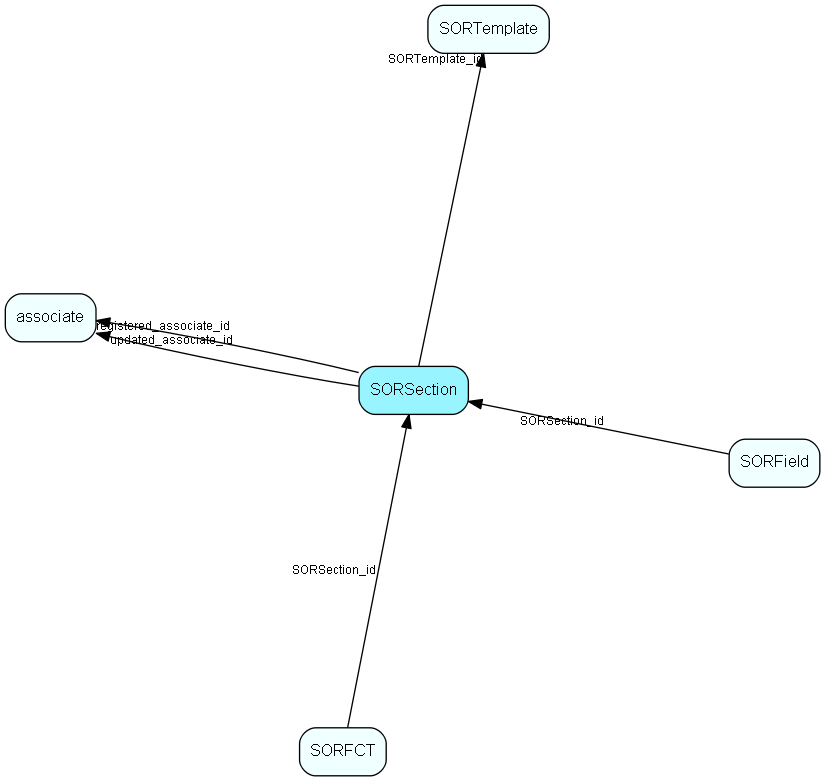

# SORSection Table (177)

SuperOffice reporter data

## Fields

| Name | Description | Type | Null |
|------|-------------|------|:----:|
|SORSection\_id|Primary key|PK| |
|SORTemplate\_id|Template ID|FK [SORTemplate](sortemplate.md)| |
|sectionType|reportheader, reportfooter, pageheader, pagefooter, detail, groupheader(1-3), groupfooter(1-3)|String(19)| |
|height|Section height in twips|UInt| |
|groupingField|Name of field used for grouping, ig group section|String(29)|&#x25CF;|
|registered|Registered when|UtcDateTime| |
|registered\_associate\_id|Registered by whom|FK [associate](associate.md)| |
|updated|Last updated when|UtcDateTime| |
|updated\_associate\_id|Last updated by whom|FK [associate](associate.md)| |
|updatedCount|Number of updates made to this record|UShort| |

[!include[details](./includes/sorsection.md)]

## Indexes

| Fields | Types | Description |
|--------|-------|-------------|
|SORSection\_id |PK |Clustered, Unique |
|SORTemplate\_id |FK |Index |

## Relationships

| Table|  Description |
|------|-------------|
|[associate](associate.md)  |Employees, resources and other users - except for External persons |
|[SORFCT](sorfct.md)  |SuperOffice reporter data |
|[SORField](sorfield.md)  |SuperOffice reporter data |
|[SORTemplate](sortemplate.md)  |SuperOffice reporter data |

## Replication Flags

* Replicate changes DOWN from central to satellites and travellers.
* Replicate changes UP from satellites and travellers back to central.
* Copy to satellite and travel prototypes.

## Security Flags

* No access control via user's Role.

