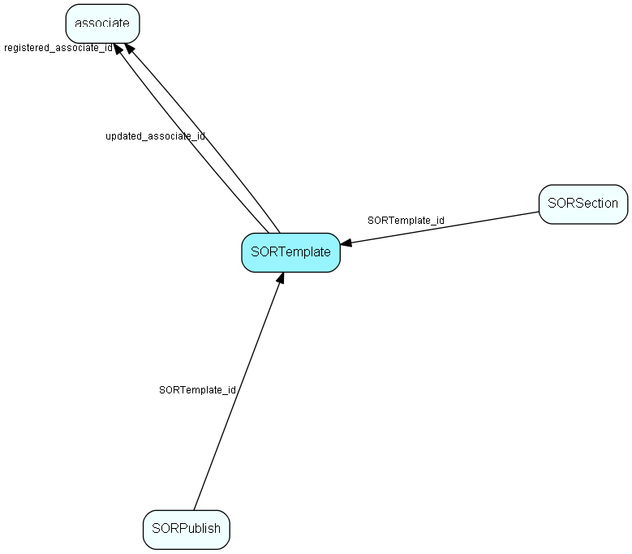

# SORTemplate Table (173)

SuperOffice reporter data

## Fields

| Name | Description | Type | Null |
|------|-------------|------|:----:|
|SORTemplate\_id|Primary key|PK| |
|subject|2=contact, 3=project, 4=sale, 5=activities, 6=selection|UShort| |
|viewName|View name|String(29)| |
|layout|1=list, 2=label, 3=group, 4=cross, 5=calendar, 6=calendar week, 7=calendar month|UShort| |
|orientation|1=portrait, 2=landscape|UShort| |
|orderBy|list of ORDER BY fields|String(254)|&#x25CF;|
|printWidth|in TWIPS|UInt| |
|bottomMargin|in TWIPS|UInt| |
|topMargin|in TWIPS|UInt| |
|leftMargin|in TWIPS|UInt| |
|rightMargin|in TWIPS|UInt| |
|published|1=pubshed, 0=not published|UShort| |
|registered|Registered when|UtcDateTime| |
|registered\_associate\_id|Registered by whom|FK [associate](associate.md)| |
|updated|Last updated when|UtcDateTime| |
|updated\_associate\_id|Last updated by whom|FK [associate](associate.md)| |
|updatedCount|Number of updates made to this record|UShort| |

[!include[details](./includes/sortemplate.md)]

## Indexes

| Fields | Types | Description |
|--------|-------|-------------|
|SORTemplate\_id |PK |Clustered, Unique |
|subject |UShort |Index |
|published |UShort |Index |

## Relationships

| Table|  Description |
|------|-------------|
|[associate](associate.md)  |Employees, resources and other users - except for External persons |
|[SORPublish](sorpublish.md)  |SuperOffice reporter data |
|[SORSection](sorsection.md)  |SuperOffice reporter data |

## Replication Flags

* Replicate changes DOWN from central to satellites and travellers.
* Replicate changes UP from satellites and travellers back to central.
* Copy to satellite and travel prototypes.

## Security Flags

* No access control via user's Role.

