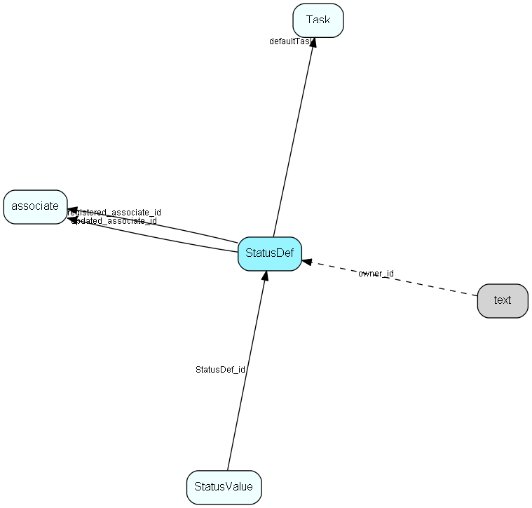

# StatusDef Table (198)

Status definitions. Name and description are in LocaleText for internationalization

## Fields

| Name | Description | Type | Null |
|------|-------------|------|:----:|
|StatusDef\_id|Primary key|PK| |
|isVisual|Should the status be visualized (active) in the client|Bool|&#x25CF;|
|needsUpdate|Is the definition dirty, ie., ALL values are invalid until a recalculation; this flag is set when the status DEFINITION is changed, as opposed to the flag on StatusValue|Bool|&#x25CF;|
|rank|Priority rank, in case more than one status is signalled. Lowest wins|UShort|&#x25CF;|
|deleted|Deleted flag, 1 if this record is deleted (never from the database)|Bool|&#x25CF;|
|ownerTable|The owning entity, currently contact or project|TableNumber|&#x25CF;|
|dirtyOnChange|If 1, the statusValue records should be set to dirty whenever information related to the owning entity changes. If 0, nothing happens.|Bool|&#x25CF;|
|defaultTask|Default task type for this status; the default task text is in the text table (since it can be long), and may contain template variables|FK [Task](task.md)|&#x25CF;|
|lastGenerated|When was the last generation finished  (i.e., statusValue rows created)|DateTime|&#x25CF;|
|numMatches|Number of targets that have this status, this should be the number of rows in StatusValue pointing to this definition, and that have isSignalled set to 1|UInt|&#x25CF;|
|numNeedUpdate|Number of targets that had this status, but have their needsUpdate bit set due to some change|UInt|&#x25CF;|
|registered|Registered when|UtcDateTime| |
|registered\_associate\_id|Registered by whom|FK [associate](associate.md)| |
|updated|Last updated when|UtcDateTime| |
|updated\_associate\_id|Last updated by whom|FK [associate](associate.md)| |
|updatedCount|Number of updates made to this record|UShort| |
|generationStart|When was the last regeneration started|DateTime|&#x25CF;|

[!include[details](./includes/statusdef.md)]

## Indexes

| Fields | Types | Description |
|--------|-------|-------------|
|StatusDef\_id |PK |Clustered, Unique |

## Relationships

| Table|  Description |
|------|-------------|
|[associate](associate.md)  |Employees, resources and other users - except for External persons |
|[StatusValue](statusvalue.md)  |Values for statuses |
|[Task](task.md)  |Task list table, activity types, like Phone, Meeting |
|[text](text.md)  |Long text fields from all over the system |

## Replication Flags

* Replicate changes DOWN from central to satellites and travellers.
* Replicate changes UP from satellites and travellers back to central.
* Copy to satellite and travel prototypes.

## Security Flags

* No access control via user's Role.

