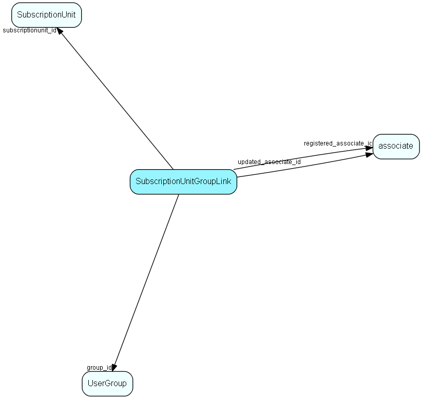

# SubscriptionUnitGroupLink Table (443)

User group link table for SubscriptionUnit, for MDO item hiding

## Fields

| Name | Description | Type | Null |
|------|-------------|------|:----:|
|subscriptionunitgrouplink\_id|Primary key|PK| |
|subscriptionunit\_id|Link to SubscriptionUnit list table|FK [SubscriptionUnit](subscriptionunit.md)| |
|group\_id|Link to Group table|FK [UserGroup](usergroup.md)| |
|registered|Registered when|UtcDateTime| |
|registered\_associate\_id|Registered by whom|FK [associate](associate.md)| |
|updated|Last updated when|UtcDateTime| |
|updated\_associate\_id|Last updated by whom|FK [associate](associate.md)| |
|updatedCount|Number of updates made to this record|UShort| |

[!include[details](./includes/subscriptionunitgrouplink.md)]

## Indexes

| Fields | Types | Description |
|--------|-------|-------------|
|subscriptionunitgrouplink\_id |PK |Clustered, Unique |
|subscriptionunit\_id |FK |Index |
|group\_id |FK |Index |

## Relationships

| Table|  Description |
|------|-------------|
|[associate](associate.md)  |Employees, resources and other users - except for External persons |
|[SubscriptionUnit](subscriptionunit.md)  |The list of Subscription units, in the internal product register (year/quarter/month etc., or perhaps amounts if volume-based subscription) |
|[UserGroup](usergroup.md)  |Secondary user groups |

## Replication Flags

* Replicate changes DOWN from central to satellites and travellers.
* Replicate changes UP from satellites and travellers back to central.
* Copy to satellite and travel prototypes.

## Security Flags

* No access control via user's Role.

