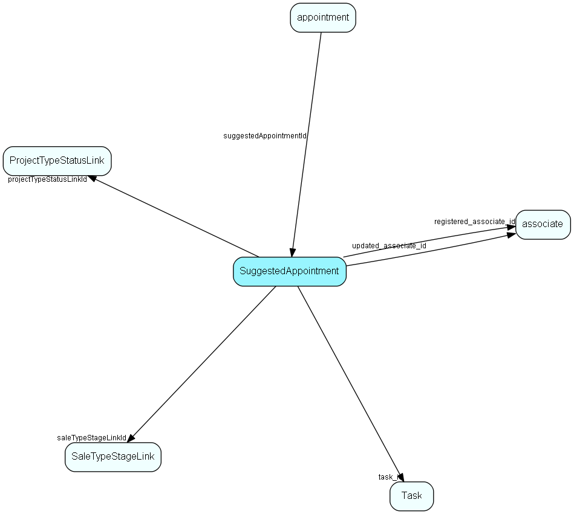

# SuggestedAppointment Table (125)

Defines a suggested appointment for use in a Sale Guide or Project Guide

## Fields

| Name | Description | Type | Null |
|------|-------------|------|:----:|
|SuggestedAppointment\_id|Primary key|PK| |
|name|Item name, visible in Guide|String(239)| |
|rank|Rank, controls rank of non-instantiated items in Guide|UShort|&#x25CF;|
|tooltip|Tooltip / description|String(254)|&#x25CF;|
|deleted|0 -&gt; record is active 1 -&gt; record is &apos;deleted&apos; and should not be shown in lists|UShort|&#x25CF;|
|saleTypeStageLinkId|Link to saleTypeStageLink, the anchor for sale guide items. Either this OR projectAnchorId should be set, not both at the same time.|FK [SaleTypeStageLink](saletypestagelink.md)|&#x25CF;|
|projectTypeStatusLinkId|Link to projectTypeStatusLink, the anchor for project guide items. Either this OR saleAnchorId should be set, not both at the same time.|FK [ProjectTypeStatusLink](projecttypestatuslink.md)|&#x25CF;|
|task\_id|Type of the suggested appointment|FK [Task](task.md)|&#x25CF;|
|daysFuture|How many days into the future the appointment should be scheduled|UShort|&#x25CF;|
|duration|Duration in minutes of suggested appointment|UShort|&#x25CF;|
|autoSuggest|Should this appointment be auto-suggested|Bool|&#x25CF;|
|text|The suggested text of the new appointment|String(2047)|&#x25CF;|
|registered|Registered when|UtcDateTime| |
|registered\_associate\_id|Registered by whom|FK [associate](associate.md)| |
|updated|Last updated when|UtcDateTime| |
|updated\_associate\_id|Last updated by whom|FK [associate](associate.md)| |
|updatedCount|Number of updates made to this record|UShort| |
|isMilestone|Is this kind of appointment a milestone in a project|Bool|&#x25CF;|
|assignToMember|Should generated appointment be assigned to a project member?|Bool|&#x25CF;|

[!include[details](./includes/suggestedappointment.md)]

## Indexes

| Fields | Types | Description |
|--------|-------|-------------|
|SuggestedAppointment\_id |PK |Clustered, Unique |
|name |String(239) |Index |
|saleTypeStageLinkId |FK |Index |
|projectTypeStatusLinkId |FK |Index |

## Relationships

| Table|  Description |
|------|-------------|
|[appointment](appointment.md)  |Tasks, appointments, followups, phone calls; and documents (document_id != 0). An appointment always has a corresponding record in VisibleFor specifying who may see this.  |
|[associate](associate.md)  |Employees, resources and other users - except for External persons |
|[ProjectTypeStatusLink](projecttypestatuslink.md)  |Many-many link table between project type and status, similar to sale type-stage link; and an anchor point for guide items |
|[SaleTypeStageLink](saletypestagelink.md)  |Many-many link table between sale type and stage; and an anchor point for guide items |
|[Task](task.md)  |Task list table, activity types, like Phone, Meeting |

## Replication Flags

* Replicate changes DOWN from central to satellites and travellers.
* Replicate changes UP from satellites and travellers back to central.
* Copy to satellite and travel prototypes.

## Security Flags

* No access control via user's Role.

