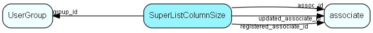

# SuperListColumnSize Table (209)

Stores the relative size (in percent) or in characters of a column in a SuperList

## Fields

| Name | Description | Type | Null |
|------|-------------|------|:----:|
|SuperListColumnSize\_id|Primary key|PK| |
|assoc\_id|Owning associate|FK [associate](associate.md)| |
|listOwner|The dialog, panel or whatever that owns this record|String(254)| |
|listColumn|The name of the column|String(254)| |
|columnSize|The size, either as a percentage, characters, or other code as needed|String(254)| |
|extraInfo|Extra information - show state, or whatever is required|String(254)| |
|registered|Registered when|UtcDateTime| |
|registered\_associate\_id|Registered by whom|FK [associate](associate.md)| |
|updated|Last updated when|UtcDateTime| |
|updated\_associate\_id|Last updated by whom|FK [associate](associate.md)| |
|updatedCount|Number of updates made to this record|UShort| |
|rank|Column rank, from left to right in display|UShort|&#x25CF;|
|orderByRank|Order by rank, 0 if this column is not part of orderby|UShort|&#x25CF;|
|orderByDirection|Direction, 1 = ascending, 2 = descending; 0 = not an orderby column|UShort|&#x25CF;|
|ownerTable|Optional owner table, if layout is bound to an owner (Selection, ...)|TableNumber|&#x25CF;|
|ownerRecord|Optional owner record id, if layout is bound to an owner|RecordId|&#x25CF;|
|group\_id|Optional group id, if layout is bound to a group|FK [UserGroup](usergroup.md)|&#x25CF;|
|configurationName|Name to show in dropdowns/menus so this configuration can be selected|String(255)|&#x25CF;|

[!include[details](./includes/superlistcolumnsize.md)]

## Indexes

| Fields | Types | Description |
|--------|-------|-------------|
|SuperListColumnSize\_id |PK |Clustered, Unique |
|assoc\_id, listOwner |FK, String(254) |Index |

## Relationships

| Table|  Description |
|------|-------------|
|[associate](associate.md)  |Employees, resources and other users - except for External persons |
|[UserGroup](usergroup.md)  |Secondary user groups |

## Replication Flags

* Area Management controlled table. Contents replicated to satellites and traveller databases.
* Replicate changes UP from satellites and travellers back to central.
* Copy to satellite and travel prototypes.

## Security Flags

* No access control via user's Role.

