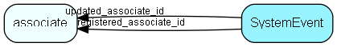

# SystemEvent Table (153)

System events, such as freetext rebuild, SAINT rebuild and such. Makes broadcasts to keep its siblings and clients updated. 

## Fields

| Name | Description | Type | Null |
|------|-------------|------|:----:|
|SystemEvent\_id|Primary key|PK| |
|scope|1 = system-wide, 2= database, 3 = group, 4 = user|Id| |
|owner|0, 0, group_id, assoc id (see over)|Id| |
|eventkey|Event key, predefined in code|String(254)|&#x25CF;|
|eventmess|Message to be shown, entered by administrator|String(254)|&#x25CF;|
|extraInfo|Extra information (area id for prototype rebuild, etc)|Id|&#x25CF;|
|eta|Estimated Time of Arrival, i.e., when will this event finish?|DateTime|&#x25CF;|
|registered|Registered when|UtcDateTime| |
|registered\_associate\_id|Registered by whom|FK [associate](associate.md)| |
|updated|Last updated when|UtcDateTime| |
|updated\_associate\_id|Last updated by whom|FK [associate](associate.md)| |
|updatedCount|Number of updates made to this record|UShort| |

[!include[details](./includes/systemevent.md)]

## Indexes

| Fields | Types | Description |
|--------|-------|-------------|
|SystemEvent\_id |PK |Clustered, Unique |
|eventkey, scope, owner |String(254), Id, Id |Unique |

## Relationships

| Table|  Description |
|------|-------------|
|[associate](associate.md)  |Employees, resources and other users - except for External persons |

## Replication Flags

* None

## Security Flags

* No access control via user's Role.

