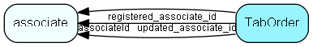

# TabOrder Table (152)

Order of tabs within a tab control, if configured by a user

## Fields

| Name | Description | Type | Null |
|------|-------------|------|:----:|
|TabOrder\_id|Primary key|PK| |
|associateId|Associate who owns this tab order|FK [associate](associate.md)| |
|tabName|Name of tab control|String(239)| |
|tabOrder|The actual tab order|String(2047)| |
|registered|Registered when|UtcDateTime| |
|registered\_associate\_id|Registered by whom|FK [associate](associate.md)| |
|updated|Last updated when|UtcDateTime| |
|updated\_associate\_id|Last updated by whom|FK [associate](associate.md)| |
|updatedCount|Number of updates made to this record|UShort| |

[!include[details](./includes/taborder.md)]

## Indexes

| Fields | Types | Description |
|--------|-------|-------------|
|TabOrder\_id |PK |Clustered, Unique |
|associateId, tabName |FK, String(239) |Index |

## Relationships

| Table|  Description |
|------|-------------|
|[associate](associate.md)  |Employees, resources and other users - except for External persons |

## Replication Flags

* Area Management controlled table. Contents replicated to satellites and traveller databases.
* Replicate changes UP from satellites and travellers back to central.
* Copy to satellite and travel prototypes.

## Security Flags

* No access control via user's Role.

