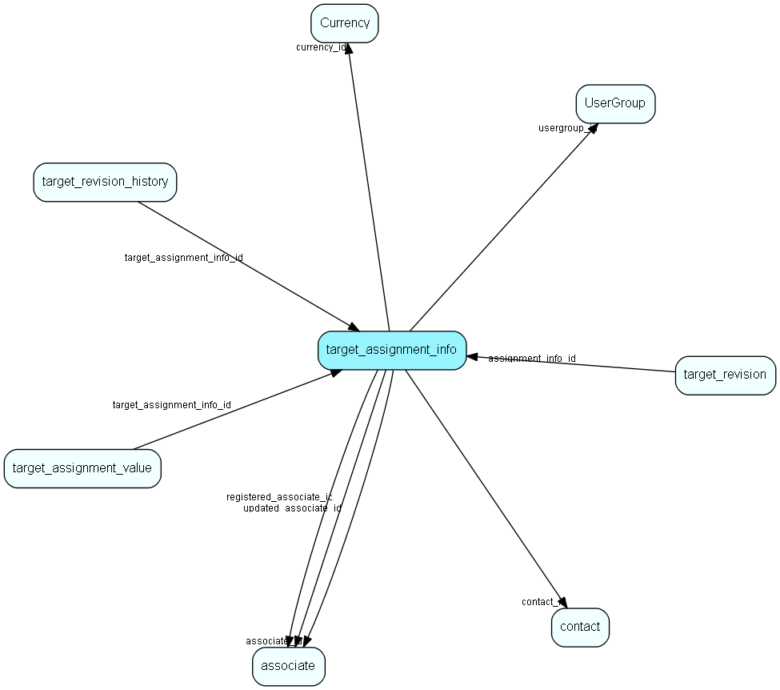

# target\_assignment\_info Table (502)

Linking associate, company or user group target and other information with target values

## Fields

| Name | Description | Type | Null |
|------|-------------|------|:----:|
|target\_assignment\_info\_id|Primary key|PK| |
|associate\_id|Associate who owns this target|FK [associate](associate.md)|&#x25CF;|
|contact\_id|Company who owns this target|FK [contact](contact.md)|&#x25CF;|
|usergroup\_id|User group who owns this target|FK [UserGroup](usergroup.md)|&#x25CF;|
|currency\_id|Currency for value|FK [Currency](currency.md)|&#x25CF;|
|locked|Locked, should not be editable|Bool|&#x25CF;|
|registered|Registered when|UtcDateTime| |
|registered\_associate\_id|Registered by whom|FK [associate](associate.md)| |
|updated|Last updated when|UtcDateTime| |
|updated\_associate\_id|Last updated by whom|FK [associate](associate.md)| |
|updatedCount|Number of updates made to this record|UShort| |
|target\_dimension\_item\_id|Dimension item this target assignment is in|Int|&#x25CF;|

[!include[details](./includes/target-assignment-info.md)]

## Indexes

| Fields | Types | Description |
|--------|-------|-------------|
|target\_assignment\_info\_id |PK |Clustered, Unique |
|associate\_id |FK |Index |
|contact\_id |FK |Index |
|usergroup\_id |FK |Index |

## Relationships

| Table|  Description |
|------|-------------|
|[associate](associate.md)  |Employees, resources and other users - except for External persons |
|[contact](contact.md)  |Companies and Organizations.   This table features a special record containing information about the contact that owns the database.   |
|[Currency](currency.md)  |Currency list table |
|[target\_assignment\_value](target-assignment-value.md)  |A set of values linked to assignment info and a period in a target group. |
|[target\_revision](target-revision.md)  |One batch of changes made to targets |
|[target\_revision\_history](target-revision-history.md)  |Revision history info in case the original target group or assignment info was deleted |
|[UserGroup](usergroup.md)  |Secondary user groups |

## Replication Flags

* None

## Security Flags

* Sentry controls access to items in this table using user's Role and data rights matrix.

