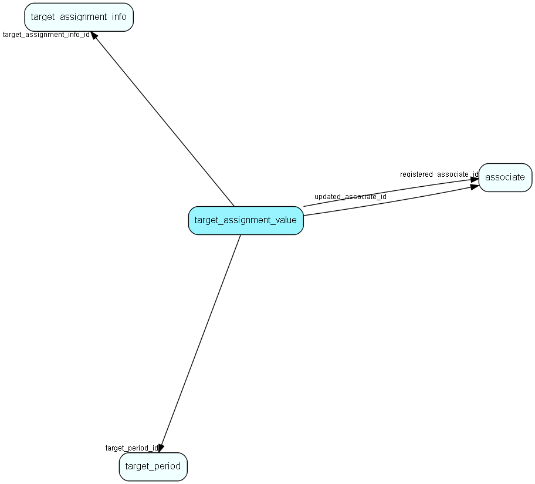

# target\_assignment\_value Table (503)

A set of values linked to assignment info and a period in a target group.

## Fields

| Name | Description | Type | Null |
|------|-------------|------|:----:|
|target\_assignment\_value\_id|Primary key|PK| |
|target\_assignment\_info\_id|Who or what this value is assigned to|FK [target_assignment_info](target-assignment-info.md)|&#x25CF;|
|target\_period\_id|The group this target belongs to|FK [target_period](target-period.md)|&#x25CF;|
|registered|Registered when|UtcDateTime| |
|registered\_associate\_id|Registered by whom|FK [associate](associate.md)| |
|updated|Last updated when|UtcDateTime| |
|updated\_associate\_id|Last updated by whom|FK [associate](associate.md)| |
|updatedCount|Number of updates made to this record|UShort| |
|target\_value|Target value|Double|&#x25CF;|

[!include[details](./includes/target-assignment-value.md)]

## Indexes

| Fields | Types | Description |
|--------|-------|-------------|
|target\_assignment\_value\_id |PK |Clustered, Unique |

## Relationships

| Table|  Description |
|------|-------------|
|[associate](associate.md)  |Employees, resources and other users - except for External persons |
|[target\_assignment\_info](target-assignment-info.md)  |Linking associate, company or user group target and other information with target values |
|[target\_period](target-period.md)  |A set of periods linked with target amounts for users/usergroups and the target groups/years. |

## Replication Flags

* None

## Security Flags

* Sentry controls access to items in this table using user's Role and data rights matrix.

