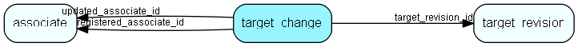

# target\_change Table (506)

A single field change.

## Fields

| Name | Description | Type | Null |
|------|-------------|------|:----:|
|target\_change\_id|Primary key|PK| |
|target\_revision\_id|The revision history changeset this change belongs to|FK [target_revision](target-revision.md)|&#x25CF;|
|field\_identifier|What field was changed - target_group.period_type or target_assignment_value.month01.target_value or target_assignment_value.quarter01.target_value etc.|String(255)|&#x25CF;|
|registered|Registered when|UtcDateTime| |
|registered\_associate\_id|Registered by whom|FK [associate](associate.md)| |
|updated|Last updated when|UtcDateTime| |
|updated\_associate\_id|Last updated by whom|FK [associate](associate.md)| |
|updatedCount|Number of updates made to this record|UShort| |
|value\_change\_from|Previous value|Double|&#x25CF;|
|value\_change\_to|New value|Double|&#x25CF;|

[!include[details](./includes/target-change.md)]

## Indexes

| Fields | Types | Description |
|--------|-------|-------------|
|target\_change\_id |PK |Clustered, Unique |
|target\_revision\_id |FK |Index |

## Relationships

| Table|  Description |
|------|-------------|
|[associate](associate.md)  |Employees, resources and other users - except for External persons |
|[target\_revision](target-revision.md)  |One batch of changes made to targets |

## Replication Flags

* None

## Security Flags

* No access control via user's Role.

