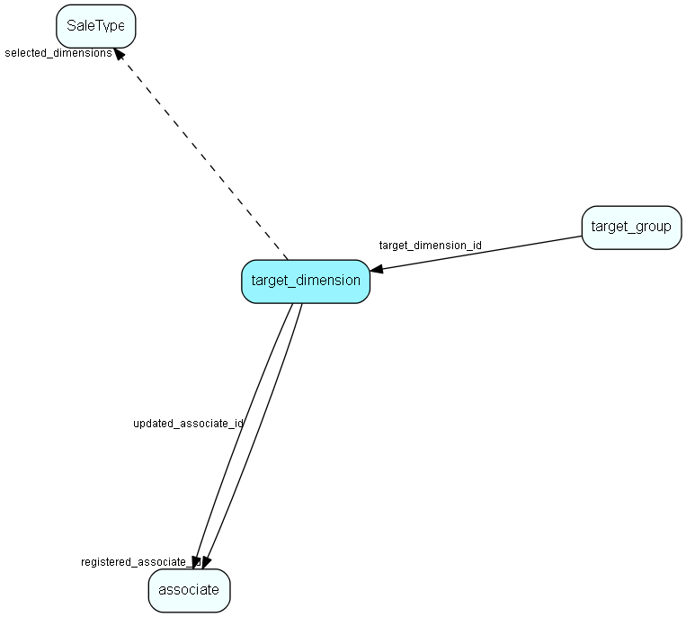

# target\_dimension Table (507)

Defining target dimension

## Fields

| Name | Description | Type | Null |
|------|-------------|------|:----:|
|target\_dimension\_id|Primary key|PK| |
|entity\_type|Entity type for this set of targets (Sale, Project, Selection, Appointment...)|Enum [TargetEntityType](enums/targetentitytype.md)|&#x25CF;|
|measurement\_unit|What to measure (Amount, Count, Profit...|Enum [TargetMeasurementUnit](enums/targetmeasurementunit.md)|&#x25CF;|
|assignment\_level|What level this dimension can be assigned to (Company, Group, Associate)|Enum [TargetAssignementLevel](enums/targetassignementlevel.md)|&#x25CF;|
|dimension\_list\_field|List that defines the dimensions for this target matrix (ex: Sale type, source, partner, business, udef or extrafield lists...)|String(255)|&#x25CF;|
|selected\_dimensions|id&apos;s of the selected/wanted dimensions (what sale types or udef list lines that should be target dimensions)|FKArray|&#x25CF;|
|registered|Registered when|UtcDateTime| |
|registered\_associate\_id|Registered by whom|FK [associate](associate.md)| |
|updated|Last updated when|UtcDateTime| |
|updated\_associate\_id|Last updated by whom|FK [associate](associate.md)| |
|updatedCount|Number of updates made to this record|UShort| |

[!include[details](./includes/target-dimension.md)]

## Indexes

| Fields | Types | Description |
|--------|-------|-------------|
|target\_dimension\_id |PK |Clustered, Unique |
|entity\_type |Enum |Index |
|selected\_dimensions |FKArray |Full text |

## Relationships

| Table|  Description |
|------|-------------|
|[associate](associate.md)  |Employees, resources and other users - except for External persons |
|[SaleType](saletype.md)  |Type of sale - large solution, incremental, whatever fits the organization |
|[target\_group](target-group.md)  |Info about a set of (sales, project, selection...) targets |

## Replication Flags

* None

## Security Flags

* Sentry controls access to items in this table using user's Role and data rights matrix.

