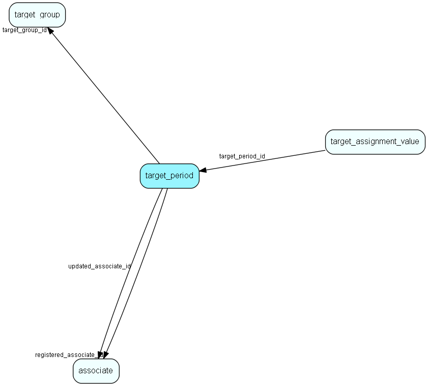

# target\_period Table (501)

A set of periods linked with target amounts for users/usergroups and the target groups/years.

## Fields

| Name | Description | Type | Null |
|------|-------------|------|:----:|
|target\_period\_id|Primary key|PK| |
|target\_group\_id|The group this target belongs to|FK [target_group](target-group.md)|&#x25CF;|
|period\_number|Month number, 1...12 (or maybe quarter number 1...4 or half year number...)|Int|&#x25CF;|
|registered|Registered when|UtcDateTime| |
|registered\_associate\_id|Registered by whom|FK [associate](associate.md)| |
|updated|Last updated when|UtcDateTime| |
|updated\_associate\_id|Last updated by whom|FK [associate](associate.md)| |
|updatedCount|Number of updates made to this record|UShort| |

[!include[details](./includes/target-period.md)]

## Indexes

| Fields | Types | Description |
|--------|-------|-------------|
|target\_period\_id |PK |Clustered, Unique |

## Relationships

| Table|  Description |
|------|-------------|
|[associate](associate.md)  |Employees, resources and other users - except for External persons |
|[target\_assignment\_value](target-assignment-value.md)  |A set of values linked to assignment info and a period in a target group. |
|[target\_group](target-group.md)  |Info about a set of (sales, project, selection...) targets |

## Replication Flags

* None

## Security Flags

* Sentry controls access to items in this table using user's Role and data rights matrix.

