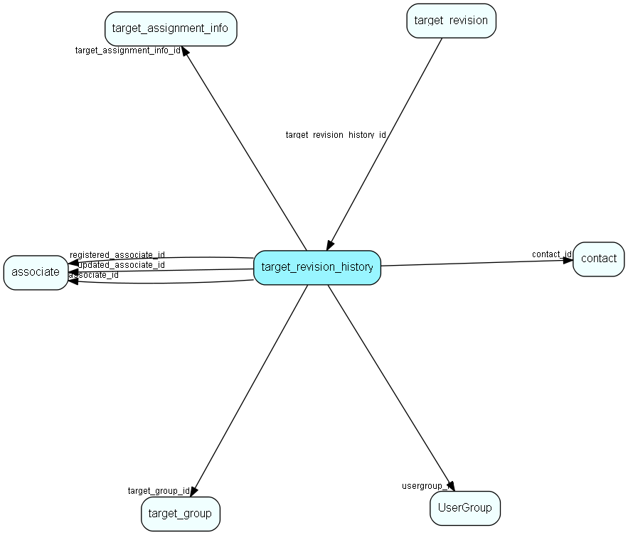

# target\_revision\_history Table (504)

Revision history info in case the original target group or assignment info was deleted

## Fields

| Name | Description | Type | Null |
|------|-------------|------|:----:|
|target\_revision\_history\_id|Primary key|PK| |
|target\_group\_id|The group id - but it may not still exist|FK [target_group](target-group.md)|&#x25CF;|
|year|The year this set of targets are associated with (2020, 2021...)|Int|&#x25CF;|
|entity\_type|Entity type for this set of targets (Sale, Project, Selection, Appointment...)|Enum [TargetEntityType](enums/targetentitytype.md)|&#x25CF;|
|associate\_id|Associate who owns this target|FK [associate](associate.md)|&#x25CF;|
|usergroup\_id|User group who owns this target|FK [UserGroup](usergroup.md)|&#x25CF;|
|contact\_id|Company who owns this target|FK [contact](contact.md)|&#x25CF;|
|registered|Registered when|UtcDateTime| |
|registered\_associate\_id|Registered by whom|FK [associate](associate.md)| |
|updated|Last updated when|UtcDateTime| |
|updated\_associate\_id|Last updated by whom|FK [associate](associate.md)| |
|updatedCount|Number of updates made to this record|UShort| |
|target\_assignment\_info\_id|TargetAssignmentInfo associated with the logged info|FK [target_assignment_info](target-assignment-info.md)|&#x25CF;|

[!include[details](./includes/target-revision-history.md)]

## Indexes

| Fields | Types | Description |
|--------|-------|-------------|
|target\_revision\_history\_id |PK |Clustered, Unique |
|target\_group\_id |FK |Unique |
|target\_assignment\_info\_id |FK |Index |

## Relationships

| Table|  Description |
|------|-------------|
|[associate](associate.md)  |Employees, resources and other users - except for External persons |
|[contact](contact.md)  |Companies and Organizations.   This table features a special record containing information about the contact that owns the database.   |
|[target\_assignment\_info](target-assignment-info.md)  |Linking associate, company or user group target and other information with target values |
|[target\_group](target-group.md)  |Info about a set of (sales, project, selection...) targets |
|[target\_revision](target-revision.md)  |One batch of changes made to targets |
|[UserGroup](usergroup.md)  |Secondary user groups |

## Replication Flags

* None

## Security Flags

* No access control via user's Role.

