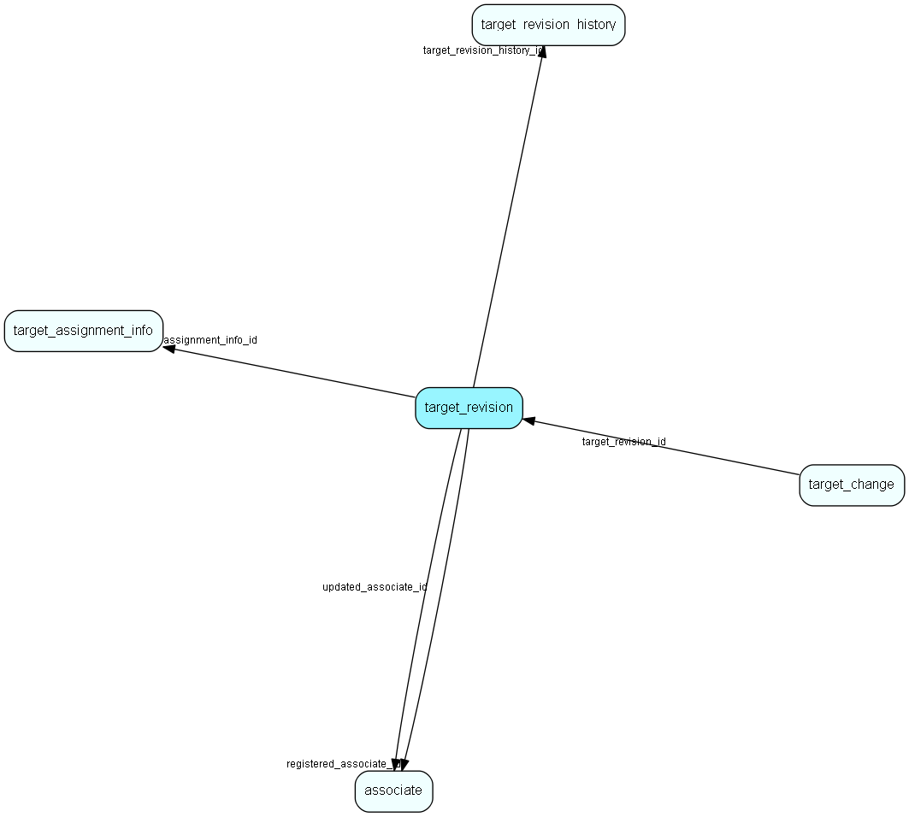

# target\_revision Table (505)

One batch of changes made to targets

## Fields

| Name | Description | Type | Null |
|------|-------------|------|:----:|
|target\_revision\_id|Primary key|PK| |
|target\_revision\_history\_id|Info about the target group this history is for|FK [target_revision_history](target-revision-history.md)|&#x25CF;|
|assignment\_info\_id|The assignment info id - but it may have been deleted|FK [target_assignment_info](target-assignment-info.md)|&#x25CF;|
|log\_event|Log event class (create, edit, delete, lock, unlock...|Enum [LogEvent](enums/logevent.md)|&#x25CF;|
|registered|Registered when|UtcDateTime| |
|registered\_associate\_id|Registered by whom|FK [associate](associate.md)| |
|updated|Last updated when|UtcDateTime| |
|updated\_associate\_id|Last updated by whom|FK [associate](associate.md)| |
|updatedCount|Number of updates made to this record|UShort| |

[!include[details](./includes/target-revision.md)]

## Indexes

| Fields | Types | Description |
|--------|-------|-------------|
|target\_revision\_id |PK |Clustered, Unique |
|assignment\_info\_id |FK |Index |

## Relationships

| Table|  Description |
|------|-------------|
|[associate](associate.md)  |Employees, resources and other users - except for External persons |
|[target\_assignment\_info](target-assignment-info.md)  |Linking associate, company or user group target and other information with target values |
|[target\_change](target-change.md)  |A single field change. |
|[target\_revision\_history](target-revision-history.md)  |Revision history info in case the original target group or assignment info was deleted |

## Replication Flags

* None

## Security Flags

* No access control via user's Role.

