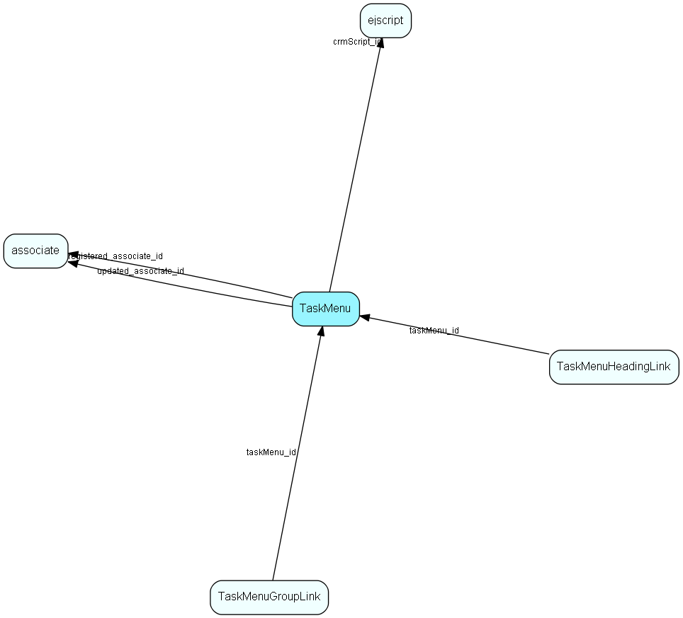

# TaskMenu Table (466)

List items to merge into menues

## Fields

| Name | Description | Type | Null |
|------|-------------|------|:----:|
|taskmenu\_id|Primary key|PK| |
|name|The list item|String(239)| |
|rank|Rank order|UShort|&#x25CF;|
|tooltip|Tooltip or other description|String(254)|&#x25CF;|
|deleted|0 -&gt; record is active 1 -&gt; record is &apos;deleted&apos; and should not be shown in lists|UShort|&#x25CF;|
|tableName|The name of entity that this task item can be used at|String(256)|&#x25CF;|
|area|Can be Task or other that can identify which menu recipe to merge the item into|String(256)|&#x25CF;|
|urlOrSoprotocol|The url or soprotocol|String(1024)|&#x25CF;|
|taskType|Type of task item Url, SoProtocol or CRMScript.|Enum [TaskListItemType](enums/tasklistitemtype.md)|&#x25CF;|
|crmScript\_id|The CRMScript or Macro which will be run task item is selected.|FK [ejscript](ejscript.md)|&#x25CF;|
|showInClient|Show task list item in which clients (web, mobile)|Enum [ShowTaskItemInClient](enums/showtaskiteminclient.md)|&#x25CF;|
|archiveBehaviour|None, rightclick on, multiselect|Enum [ArchiveBehaviour](enums/archivebehaviour.md)|&#x25CF;|
|registered|Registered when|UtcDateTime| |
|registered\_associate\_id|Registered by whom|FK [associate](associate.md)| |
|updated|Last updated when|UtcDateTime| |
|updated\_associate\_id|Last updated by whom|FK [associate](associate.md)| |
|updatedCount|Number of updates made to this record|UShort| |
|encoding|Encoding for url|Enum [UrlEncoding](enums/urlencoding.md)|&#x25CF;|

[!include[details](./includes/taskmenu.md)]

## Indexes

| Fields | Types | Description |
|--------|-------|-------------|
|taskmenu\_id |PK |Clustered, Unique |
|name |String(239) |Unique |

## Relationships

| Table|  Description |
|------|-------------|
|[associate](associate.md)  |Employees, resources and other users - except for External persons |
|[ejscript](ejscript.md)  |ejscript |
|[TaskMenuGroupLink](taskmenugrouplink.md)  |User group link table for TaskMenu, for MDO item hiding |
|[TaskMenuHeadingLink](taskmenuheadinglink.md)  |Heading link table for TaskMenu, for MDO headers |

## Replication Flags

* None

## Security Flags

* No access control via user's Role.

