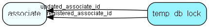

# temp\_db\_lock Table (519)

Represents a temporary lock on a resource identified by table_id and key

## Fields

| Name | Description | Type | Null |
|------|-------------|------|:----:|
|temp\_db\_lock\_id|Primary key|PK| |
|table\_number|The table number (or domain) of the locked resource|TableNumber|&#x25CF;|
|key|The key/id of the locked resource|RecordId|&#x25CF;|
|timeout\_at|When this lock times out. Refreshing this while working is a good idea.|UtcDateTime|&#x25CF;|
|registered|Registered when|UtcDateTime| |
|registered\_associate\_id|Registered by whom|FK [associate](associate.md)| |
|updated|Last updated when|UtcDateTime| |
|updated\_associate\_id|Last updated by whom|FK [associate](associate.md)| |
|updatedCount|Number of updates made to this record|UShort| |

[!include[details](./includes/temp-db-lock.md)]

## Indexes

| Fields | Types | Description |
|--------|-------|-------------|
|temp\_db\_lock\_id |PK |Clustered, Unique |
|table\_number |TableNumber |Index |
|key |RecordId |Index |

## Relationships

| Table|  Description |
|------|-------------|
|[associate](associate.md)  |Employees, resources and other users - except for External persons |

## Replication Flags

* None

## Security Flags

* No access control via user's Role.

