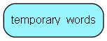

# temporary\_words Table (356)

This table is used as a temporary table, containing the words we want                  to search for in the FAQs

## Fields

| Name | Description | Type | Null |
|------|-------------|------|:----:|
|id|Primary key|PK| |
|magic\_number|A magic number, securing unique rows|Int| |
|word|The temporary word|String(63)| |
|word\_length|The length of the word|Int| |

[!include[details](./includes/temporary-words.md)]

## Indexes

| Fields | Types | Description |
|--------|-------|-------------|
|id |PK |Clustered, Unique |
|word |String(63) |Index |
|word\_length |Int |Index |

## Replication Flags

* None

## Security Flags

* No access control via user's Role.

