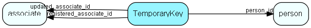

# TemporaryKey Table (499)

Temporary keys for lightweight authentications such as changing ones subscriptions

## Fields

| Name | Description | Type | Null |
|------|-------------|------|:----:|
|temporarykey\_id|Primary key|PK| |
|domain|The domain this is a key for|Enum [TemporaryKeyDomain](enums/temporarykeydomain.md)| |
|target\_id|The primary key in the table this is a key for|Int|&#x25CF;|
|person\_id|The person this is a key for|FK [person](person.md)|&#x25CF;|
|authkey|The actual key|String(256)| |
|expires|When this key expires (server localtime)|DateTime|&#x25CF;|
|registered|Registered when|UtcDateTime| |
|registered\_associate\_id|Registered by whom|FK [associate](associate.md)| |
|updated|Last updated when|UtcDateTime| |
|updated\_associate\_id|Last updated by whom|FK [associate](associate.md)| |
|updatedCount|Number of updates made to this record|UShort| |
|payload|Optional field that may contain arbitrary data used when the key is verified, dependent on the domain|String(4000)|&#x25CF;|

[!include[details](./includes/temporarykey.md)]

## Indexes

| Fields | Types | Description |
|--------|-------|-------------|
|temporarykey\_id |PK |Clustered, Unique |

## Relationships

| Table|  Description |
|------|-------------|
|[associate](associate.md)  |Employees, resources and other users - except for External persons |
|[person](person.md)  |Persons in a company or an organizations. All associates have a corresponding person record |

## Replication Flags

* None

## Security Flags

* No access control via user's Role.

