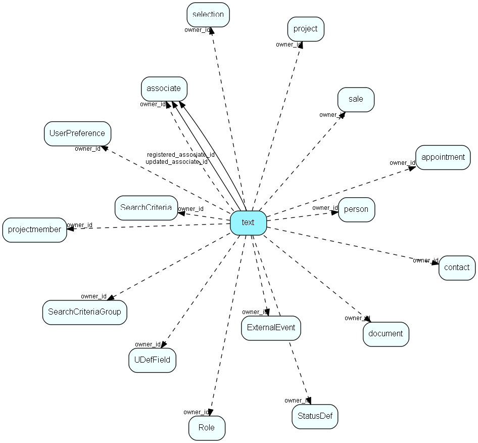

# text Table (18)

Long text fields from all over the system

## Fields

| Name | Description | Type | Null |
|------|-------------|------|:----:|
|text\_id|Primary key|PK| |
|type|Text type, enum that specifies owning table and role|Enum [TextType](enums/texttype.md)|&#x25CF;|
|owner\_id|Record ID of owner record|Id|&#x25CF;|
|registered|Registered when|UtcDateTime| |
|registered\_associate\_id|Registered by whom|FK [associate](associate.md)| |
|updated|Last updated when|UtcDateTime| |
|updated\_associate\_id|Last updated by whom|FK [associate](associate.md)| |
|updatedCount|Table number of list table that this text contains an extension of; this is obsolete functionality|TableNumber| |
|text|The actual text, max 2047 significant characters even though it is stored as a larger data type on some databases|String(4000)|&#x25CF;|
|lcid|Language/culture code of the text, if known. This is a reserved field for future use|UShort|&#x25CF;|
|seqno|Sequence number, for possible chaining of multiple records to store longer texts|UShort|&#x25CF;|
|html\_text|Formatted text suitable for html text editors|Clob|&#x25CF;|

[!include[details](./includes/text.md)]

## Indexes

| Fields | Types | Description |
|--------|-------|-------------|
|text\_id |PK |Clustered, Unique |
|owner\_id, type |Id, Enum |Index |
|text |String(4000) |Full text |

## Relationships

| Table|  Description |
|------|-------------|
|[appointment](appointment.md)  |Tasks, appointments, followups, phone calls; and documents (document_id != 0). An appointment always has a corresponding record in VisibleFor specifying who may see this.  |
|[associate](associate.md)  |Employees, resources and other users - except for External persons |
|[contact](contact.md)  |Companies and Organizations.   This table features a special record containing information about the contact that owns the database.   |
|[document](document.md)  |Documents, this table is an extension of the Appointment table.  There is always a corresponding appointment record; the relation between appointment and document is navigable in both directions. A document-type appointment record always has a corresponding document record and a record in VisibleFor specifying who may see this.   |
|[ExternalEvent](externalevent.md)  |The definition of projects as events in Audience (or other Collaborative apps) |
|[person](person.md)  |Persons in a company or an organizations. All associates have a corresponding person record |
|[project](project.md)  |Projects |
|[projectmember](projectmember.md)  |Project members. Link-table between person and project |
|[Role](role.md)  |User roles for role-based security, names and tooltips are in LocaleText. For more information regarding role based security, see http://techdoc.superoffice.com |
|[sale](sale.md)  |Sales  For every Sale record edited through the SuperOffice GUI, a copy of the current version of the record will be saved in the SaleHist table. This also applies to editing done through the SaleModel COM interface, but not to editing done through the OLE DB Provider or other channels.   |
|[SaleHist](salehist.md)  |Mirror image of the Sale table, providing a full transaction history. Every time you edit a sale, the current record of the sale is also saved here.  |
|[SearchCriteria](searchcriteria.md)  |Criteria storage for Selection and other Find mechanisms |
|[SearchCriteriaGroup](searchcriteriagroup.md)  |Criteria storage for Selection and other Find mechanisms |
|[selection](selection.md)  |Selections |
|[StatusDef](statusdef.md)  |Status definitions. Name and description are in LocaleText for internationalization |
|[UDefField](udeffield.md)  |Definition table for user-defined fields; one row in this table corresponds to one generation of one field. The user defined fields that are in use, and earlier versions of user defined fields. ColumnId refers to the field type; see UDXXXSmall or UDXXXLarge for the referring ID.  Preferences prefsection=&apos;System&apos;, prefkey=&apos;CurrentUdefVersioncontact&apos;  (or CurrentUdefVersionperson, project, sale), gives you the current version of user defined fields.  prefkey=&apos;AdminUdefVersion&lt;...&gt;&apos; gives you the current version that&apos;s being edited. If Current version = admin version, no editing has been done since the last Publish of user defined field was performed. |
|[UserPreference](userpreference.md)  |Preference system. If deflevel is set to 5; the user may change the preferences |

## Replication Flags

* Area Management controlled table. Contents replicated to satellites and traveller databases.
* Replicate changes UP from satellites and travellers back to central.
* Copy to satellite and travel prototypes.

## Security Flags

* Sentry controls access to items in this table using user's Role and data rights matrix on the table's parent.

