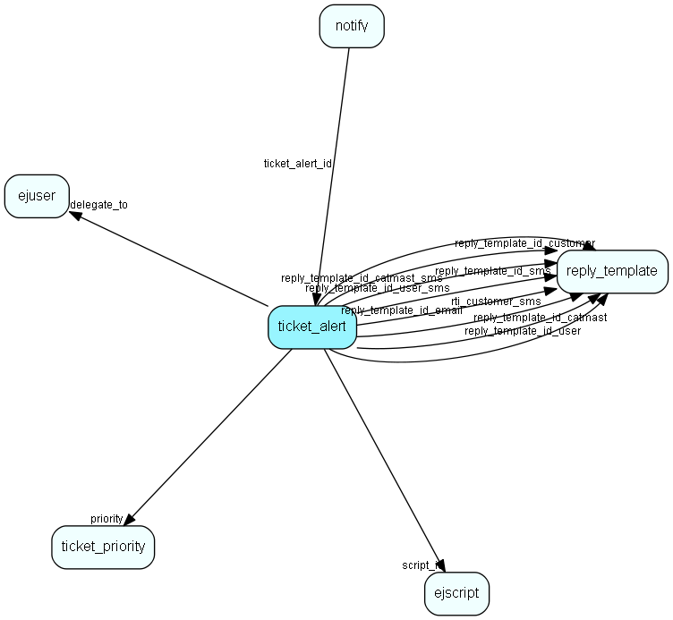

# ticket\_alert Table (274)

This table will contain ticket escalation levels. A ticket will be escalated along a &amp;apos;chain&amp;apos; of these levels.

## Fields

| Name | Description | Type | Null |
|------|-------------|------|:----:|
|id|The primary key (auto-incremented)|PK| |
|priority|The id of the ticket_priority entry this entry is connected to.|FK [ticket_priority](ticket-priority.md)| |
|alert\_level|The alert level (strictly ascending number).|Short|&#x25CF;|
|alert\_timeout|The time (in minutes) before ticket is escalated to next level.|Int|&#x25CF;|
|action|Bitmap indicating what should be done when escalating *to* this level.|Int|&#x25CF;|
|delegate\_to|If ticket should be redelegated on escalation, this field contains the id of the target user.|FK [ejuser](ejuser.md)|&#x25CF;|
|script\_id|Script that can be executed then the ticket alert action occur.|FK [ejscript](ejscript.md)|&#x25CF;|
|email\_to|If an email should be sent when escalating, this field will contain the recipient email address.|String(255)|&#x25CF;|
|sms\_to|If an sms should be sent when escalating, this field will contain the recipient email address.|String(255)|&#x25CF;|
|reply\_template\_id\_customer|Reference to the reply template used in this alert, for mail to customer|FK [reply_template](reply-template.md)|&#x25CF;|
|reply\_template\_id\_user|Reference to the reply template used in this alert, for mail to owner of ticket|FK [reply_template](reply-template.md)|&#x25CF;|
|reply\_template\_id\_catmast|Reference to the reply template used in this alert, for mail to category master|FK [reply_template](reply-template.md)|&#x25CF;|
|reply\_template\_id\_email|Reference to the reply template used in this alert, for mail to custom address|FK [reply_template](reply-template.md)|&#x25CF;|
|rti\_customer\_sms|Reference to the reply template used in this alert, for sms to customer|FK [reply_template](reply-template.md)|&#x25CF;|
|reply\_template\_id\_user\_sms|Reference to the reply template used in this alert, for sms to owner of ticket|FK [reply_template](reply-template.md)|&#x25CF;|
|reply\_template\_id\_catmast\_sms|Reference to the reply template used in this alert, for sms to category master|FK [reply_template](reply-template.md)|&#x25CF;|
|reply\_template\_id\_sms|Reference to the reply template used in this alert, for sms to custom address|FK [reply_template](reply-template.md)|&#x25CF;|

[!include[details](./includes/ticket-alert.md)]

## Indexes

| Fields | Types | Description |
|--------|-------|-------------|
|id |PK |Clustered, Unique |
|priority |FK |Index |
|delegate\_to |FK |Index |
|script\_id |FK |Index |
|reply\_template\_id\_customer |FK |Index |
|reply\_template\_id\_user |FK |Index |
|reply\_template\_id\_catmast |FK |Index |
|reply\_template\_id\_email |FK |Index |
|rti\_customer\_sms |FK |Index |
|reply\_template\_id\_user\_sms |FK |Index |
|reply\_template\_id\_catmast\_sms |FK |Index |
|reply\_template\_id\_sms |FK |Index |

## Relationships

| Table|  Description |
|------|-------------|
|[ejscript](ejscript.md)  |ejscript |
|[ejuser](ejuser.md)  |This table contains entries for the users of the system. |
|[notify](notify.md)  |This table contains the pop-up messages displayed for users for various events, such as &amp;apos;new ticket&amp;apos;, etc. |
|[reply\_template](reply-template.md)  |Templates for automatic and manual replies to emails/sms organized hierachically |
|[ticket\_priority](ticket-priority.md)  |This table contains the ticket priorities. |

## Replication Flags

* None

## Security Flags

* No access control via user's Role.

