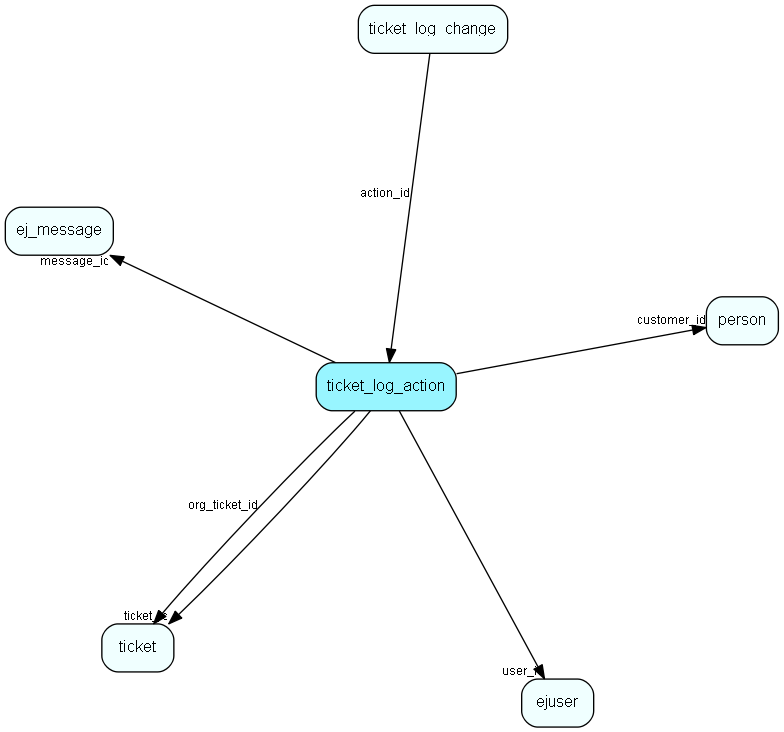

# ticket\_log\_action Table (269)

This table contains actions for the tickets.

## Fields

| Name | Description | Type | Null |
|------|-------------|------|:----:|
|id|The primary key (auto-incremented)|PK| |
|ticket\_id|The id of the ticket this entry is connected to.|FK [ticket](ticket.md)| |
|org\_ticket\_id|The id of the orignal ticket this entry was connected to.|FK [ticket](ticket.md)| |
|message\_id|If this entry is connected to a message, then this is a message change log entry.|FK [ej_message](ej-message.md)| |
|user\_id|The id of the user this entry is connected to.|FK [ejuser](ejuser.md)| |
|customer\_id|The id of the customer this entry is connected to.|FK [person](person.md)| |
|log\_when|When the action occured.|DateTime|&#x25CF;|
|log\_action|An enum indicating what kind of log-entry this is.|Enum [TicketLogAction](enums/ticketlogaction.md)|&#x25CF;|
|description|Action description, only used by customer actions like ejscript|String(255)| |
|details|Field for storing details of the log action as e.g. JSON|Clob|&#x25CF;|

[!include[details](./includes/ticket-log-action.md)]

## Indexes

| Fields | Types | Description |
|--------|-------|-------------|
|id |PK |Clustered, Unique |
|ticket\_id |FK |Index |
|org\_ticket\_id |FK |Index |
|message\_id |FK |Index |
|user\_id |FK |Index |
|customer\_id |FK |Index |

## Relationships

| Table|  Description |
|------|-------------|
|[ej\_message](ej-message.md)  |This table contains the messages listed under tickets. |
|[ejuser](ejuser.md)  |This table contains entries for the users of the system. |
|[person](person.md)  |Persons in a company or an organizations. All associates have a corresponding person record |
|[ticket](ticket.md)  |This table contains the tickets (requests) of the system. Its purpose should be evident. |
|[ticket\_log\_change](ticket-log-change.md)  |This table contains log entries for the tickets. |

## Replication Flags

* None

## Security Flags

* No access control via user's Role.

