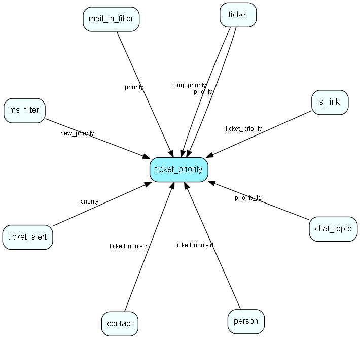

# ticket\_priority Table (275)

This table contains the ticket priorities.

## Fields

| Name | Description | Type | Null |
|------|-------------|------|:----:|
|id|The primary key (auto-incremented)|PK| |
|name|The name of the priority.|String(64)|&#x25CF;|
|status|The status (normal/deleted) of the priority.|Enum [TicketPriorityStatus](enums/ticketprioritystatus.md)|&#x25CF;|
|flags|A bitmask of flags.|Enum [TicketPriorityFlags](enums/ticketpriorityflags.md)|&#x25CF;|
|mon\_start|The work hour start for Mondays. Note that only the time part of the DateTime is used|DateTime|&#x25CF;|
|mon\_stop|The work hour start for Mondays. Note that only the time part of the DateTime is used|DateTime|&#x25CF;|
|tue\_start|The work hour start for Tuesdays. Note that only the time part of the DateTime is used|DateTime|&#x25CF;|
|tue\_stop|The work hour stop for Tuesdays. Note that only the time part of the DateTime is used|DateTime|&#x25CF;|
|wed\_start|The work hour start for Wednesdays. Note that only the time part of the DateTime is used|DateTime|&#x25CF;|
|wed\_stop|The work hour stop for Wednesdays. Note that only the time part of the DateTime is used|DateTime|&#x25CF;|
|thu\_start|The work hour start for Thursdays. Note that only the time part of the DateTime is used|DateTime|&#x25CF;|
|thu\_stop|The work hour stop for Thursdays. Note that only the time part of the DateTime is used|DateTime|&#x25CF;|
|fri\_start|The work hour start for Fridays. Note that only the time part of the DateTime is used|DateTime|&#x25CF;|
|fri\_stop|The work hour stop for Fridays. Note that only the time part of the DateTime is used|DateTime|&#x25CF;|
|sat\_start|The work hour start for Saturdays. Note that only the time part of the DateTime is used|DateTime|&#x25CF;|
|sat\_stop|The work hour stop for Saturdays. Note that only the time part of the DateTime is used|DateTime|&#x25CF;|
|sun\_start|The work hour start for Sundays. Note that only the time part of the DateTime is used|DateTime|&#x25CF;|
|sun\_stop|The work hour stop for Sundays. Note that only the time part of the DateTime is used|DateTime|&#x25CF;|
|non\_dates|A comma separated list of dates (dd/mm) which should be excluded from the timeframe.|String(255)|&#x25CF;|
|deadline|Deadline to add if escalated (minutes)|Int|&#x25CF;|
|sort\_order|Indicates the sort order for this priority. 1 is first, 100 is last|Int|&#x25CF;|
|ticket\_read|This field indicates what to do with the escalation chain when the request is read|Enum [TicketPriorityEscalateEvent](enums/ticketpriorityescalateevent.md)|&#x25CF;|
|changed\_owner|This field indicates what to do with the escalation chain when the request changes owner (manually)|Enum [TicketPriorityEscalateEvent](enums/ticketpriorityescalateevent.md)|&#x25CF;|
|ticket\_newinfo|This field indicates what to do with the escalation chain when the request gets new info|Enum [TicketPriorityEscalateEvent](enums/ticketpriorityescalateevent.md)|&#x25CF;|
|ticket\_closed|This field indicates what to do with the escalation chain when the request is closed|Enum [TicketPriorityEscalateEvent](enums/ticketpriorityescalateevent.md)|&#x25CF;|
|ticket\_changed\_priority|This field indicates what to do with the escalation chain when the request is changed into this priority|Enum [TicketPriorityEscalateEvent](enums/ticketpriorityescalateevent.md)|&#x25CF;|
|ticket\_new|This field indicates what to do with the escalation chain when a new request is registered|Enum [TicketPriorityEscalateEvent](enums/ticketpriorityescalateevent.md)| |

[!include[details](./includes/ticket-priority.md)]

## Indexes

| Fields | Types | Description |
|--------|-------|-------------|
|id |PK |Clustered, Unique |

## Relationships

| Table|  Description |
|------|-------------|
|[chat\_topic](chat-topic.md)  |This table contains chat topics. |
|[contact](contact.md)  |Companies and Organizations.   This table features a special record containing information about the contact that owns the database.   |
|[mail\_in\_filter](mail-in-filter.md)  |This table contains entries for the mailboxes the eJournal system is fetching mail from (POP3 or IMAP). |
|[ms\_filter](ms-filter.md)  |This table contains email filters. These are the filters allowing you to do advanced parsing of incomming emails. |
|[person](person.md)  |Persons in a company or an organizations. All associates have a corresponding person record |
|[s\_link](s-link.md)  |Links in messages to measure success rate of a campaign. |
|[ticket](ticket.md)  |This table contains the tickets (requests) of the system. Its purpose should be evident. |
|[ticket\_alert](ticket-alert.md)  |This table will contain ticket escalation levels. A ticket will be escalated along a &amp;apos;chain&amp;apos; of these levels. |
|[ticket\_type](ticket-type.md)  |A ticket (request) type |
|[ticket\_type\_priority](ticket-type-priority.md)  |Link table defining what Priorities are relevant to a particular Ticket type |

## Replication Flags

* None

## Security Flags

* No access control via user's Role.

