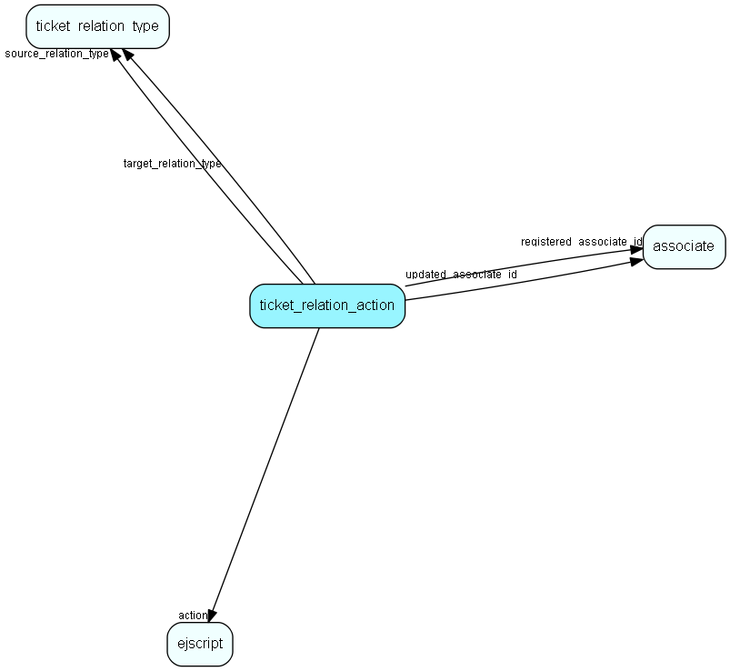

# ticket\_relation\_action Table (453)

Contains ticket relation actions, used to drive processing logic together with ticket relations

## Fields

| Name | Description | Type | Null |
|------|-------------|------|:----:|
|id|Primary key|PK| |
|event||Enum [ScreenChooserType](enums/screenchoosertype.md)|&#x25CF;|
|source\_relation\_type|This action is bound to the given relation_type, for events on the relation&apos;s ticket_source|FK [ticket_relation_type](ticket-relation-type.md)|&#x25CF;|
|target\_relation\_type|This action is bound to the given relation_type, for events on the relation&apos;s ticket_target|FK [ticket_relation_type](ticket-relation-type.md)|&#x25CF;|
|action|The ejScript to be executed|FK [ejscript](ejscript.md)|&#x25CF;|
|rank|Order of execution|UShort|&#x25CF;|
|registered|Registered when|UtcDateTime|&#x25CF;|
|registered\_associate\_id|Registered by whom|FK [associate](associate.md)|&#x25CF;|
|updated|Last updated when|UtcDateTime|&#x25CF;|
|updated\_associate\_id|Last updated by whom|FK [associate](associate.md)|&#x25CF;|
|updatedCount|Number of updates made to this record|UShort|&#x25CF;|

[!include[details](./includes/ticket-relation-action.md)]

## Indexes

| Fields | Types | Description |
|--------|-------|-------------|
|id |PK |Clustered, Unique |

## Relationships

| Table|  Description |
|------|-------------|
|[associate](associate.md)  |Employees, resources and other users - except for External persons |
|[ejscript](ejscript.md)  |ejscript |
|[ticket\_relation\_type](ticket-relation-type.md)  |Contains ticket relation types, used to drive processing logic together with ticket relations |

## Replication Flags

* None

## Security Flags

* No access control via user's Role.

