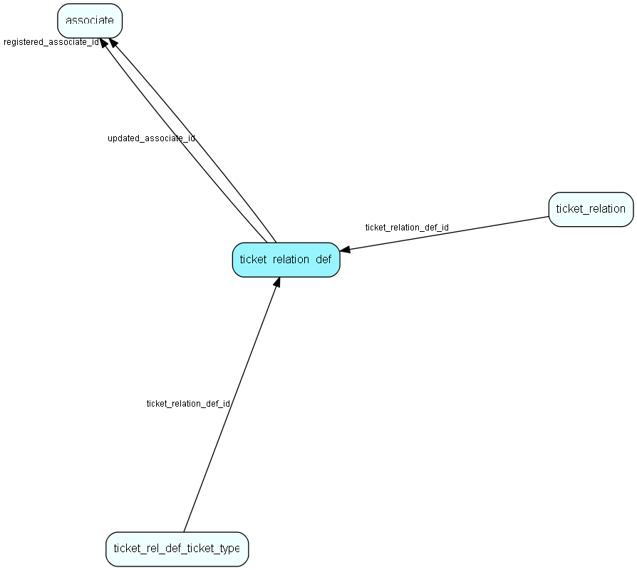

# ticket\_relation\_def Table (545)

Ticket relation definition

## Fields

| Name | Description | Type | Null |
|------|-------------|------|:----:|
|ticket\_relation\_def\_id|Primary key|PK| |
|name|The name of this Ticket relation|String(4000)| |
|description|Tooltip or other description|String(4000)|&#x25CF;|
|rank|Rank order|UShort|&#x25CF;|
|relation\_type|Type of the relation (Related, Parent, Child)|Enum [TicketRelationType](enums/ticketrelationtype.md)| |
|is\_parent\_mandatory|Parent relation is mandatory when a new request is created|Bool|&#x25CF;|
|is\_close\_parent\_with\_child|Close parent when all children are closed|Bool|&#x25CF;|
|is\_prevent\_closing\_parent|Prevent closing parent until all children are closed|Bool|&#x25CF;|
|is\_close\_with\_parent|Offer to close all related when parent is closed|Bool|&#x25CF;|
|registered|Registered when|UtcDateTime| |
|registered\_associate\_id|Registered by whom|FK [associate](associate.md)| |
|updated|Last updated when|UtcDateTime| |
|updated\_associate\_id|Last updated by whom|FK [associate](associate.md)| |
|updatedCount|Number of updates made to this record|UShort| |
|isBuiltIn|Is this row part of SuperOffice priming data|Bool|&#x25CF;|

[!include[details](./includes/ticket-relation-def.md)]

## Indexes

| Fields | Types | Description |
|--------|-------|-------------|
|ticket\_relation\_def\_id |PK |Clustered, Unique |
|name |String(4000) |Unique |

## Relationships

| Table|  Description |
|------|-------------|
|[associate](associate.md)  |Employees, resources and other users - except for External persons |
|[ticket\_rel\_def\_ticket\_type](ticket-rel-def-ticket-type.md)  |Link table defining what Ticket types are involved in this relation. Will have M:N rows for a single relation definition |
|[ticket\_relation](ticket-relation.md)  |A relation between 2 tickets |

## Replication Flags

* None

## Security Flags

* No access control via user's Role.

