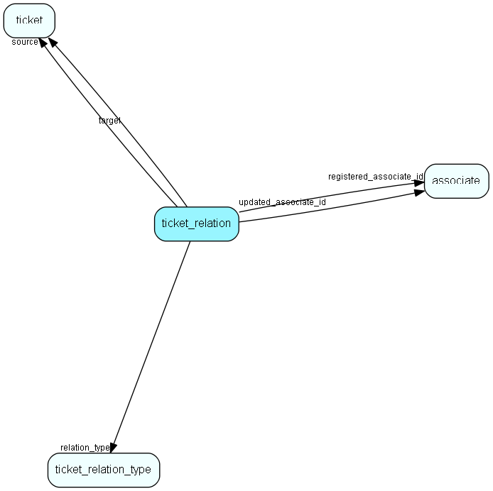

# ticket\_relation Table (547)

A relation between 2 tickets

## Fields

| Name | Description | Type | Null |
|------|-------------|------|:----:|
|ticket\_relation\_id|Primary key|PK| |
|source\_ticket\_id|Source ticket in this relation|FK [ticket](ticket.md)| |
|destination\_ticket\_id|Destination ticket in this relation|FK [ticket](ticket.md)| |
|ticket\_relation\_def\_id|The (optional) relation definition where this relation originated from|FK [ticket_relation_def](ticket-relation-def.md)| |
|comment|Comment for relation|String(255)|&#x25CF;|
|registered|Registered when|UtcDateTime| |
|registered\_associate\_id|Registered by whom|FK [associate](associate.md)| |
|updated|Last updated when|UtcDateTime| |
|updated\_associate\_id|Last updated by whom|FK [associate](associate.md)| |
|updatedCount|Number of updates made to this record|UShort| |

[!include[details](./includes/ticket-relation.md)]

## Indexes

| Fields | Types | Description |
|--------|-------|-------------|
|ticket\_relation\_id |PK |Clustered, Unique |
|source\_ticket\_id |FK |Index |
|destination\_ticket\_id |FK |Index |

## Relationships

| Table|  Description |
|------|-------------|
|[associate](associate.md)  |Employees, resources and other users - except for External persons |
|[ticket](ticket.md)  |This table contains the tickets (requests) of the system. Its purpose should be evident. |
|[ticket\_relation\_def](ticket-relation-def.md)  |Ticket relation definition |

## Replication Flags

* None

## Security Flags

* No access control via user's Role.

