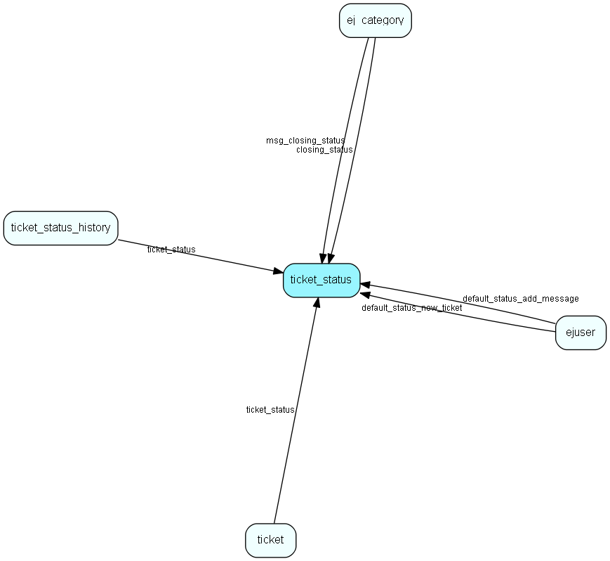

# ticket\_status Table (263)

This table user defined ticket status values.

## Fields

| Name | Description | Type | Null |
|------|-------------|------|:----:|
|id|The primary key (auto-incremented)|PK| |
|status|The &amp;apos;classic&amp;apos; ticket status. I.e. active/closed/postponed/deleted|Enum [TicketBaseStatus](enums/ticketbasestatus.md)| |
|ts\_rank|Sort order|Int| |
|name|Name of user defined ticket status|String(255)| |
|time\_counter|Which field in ticket we count time spent on (queue, internal, external) |Enum [TicketStatusTimeCounter](enums/ticketstatustimecounter.md)|&#x25CF;|
|deleted|Whether the status is deleted (unavailable) or not|Bool|&#x25CF;|
|no\_email\_reopen|Whether inbound emails can reopen requests with this status or not|Bool|&#x25CF;|

[!include[details](./includes/ticket-status.md)]

## Indexes

| Fields | Types | Description |
|--------|-------|-------------|
|id |PK |Clustered, Unique |
|status |Enum |Index |

## Relationships

| Table|  Description |
|------|-------------|
|[ej\_category](ej-category.md)  |This table contains categories, in which tickets are categorized. The categories are organized in a hierarchial manner. |
|[ejuser](ejuser.md)  |This table contains entries for the users of the system. |
|[ticket](ticket.md)  |This table contains the tickets (requests) of the system. Its purpose should be evident. |
|[ticket\_status\_history](ticket-status-history.md)  |This table contains the history of a tickets statuses. Each time a ticket changes status a copy of the previous status of the record will be saved  |
|[ticket\_type](ticket-type.md)  |A ticket (request) type |
|[ticket\_type\_status](ticket-type-status.md)  |Link table defining what Statuses are relevant to a particular Ticket type |

## Replication Flags

* None

## Security Flags

* No access control via user's Role.

