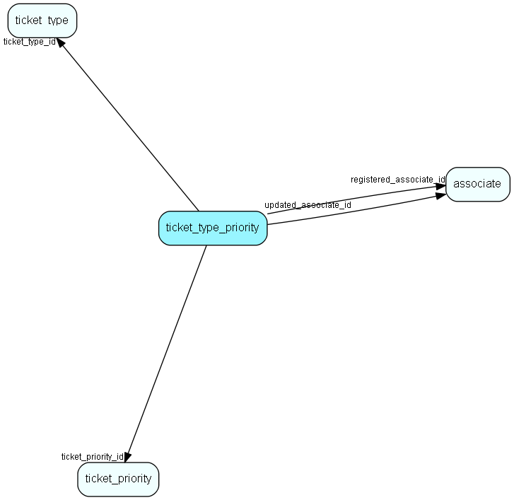

# ticket\_type\_priority Table (533)

Link table defining what Priorities are relevant to a particular Ticket type

## Fields

| Name | Description | Type | Null |
|------|-------------|------|:----:|
|ticket\_type\_priority\_id|Primary key|PK| |
|ticket\_type\_id|Ticket type |FK [ticket_type](ticket-type.md)| |
|ticket\_priority\_id|Ticket priority|FK [ticket_priority](ticket-priority.md)| |
|registered|Registered when|UtcDateTime| |
|registered\_associate\_id|Registered by whom|FK [associate](associate.md)| |
|updated|Last updated when|UtcDateTime| |
|updated\_associate\_id|Last updated by whom|FK [associate](associate.md)| |
|updatedCount|Number of updates made to this record|UShort| |

[!include[details](./includes/ticket-type-priority.md)]

## Indexes

| Fields | Types | Description |
|--------|-------|-------------|
|ticket\_type\_priority\_id |PK |Clustered, Unique |

## Relationships

| Table|  Description |
|------|-------------|
|[associate](associate.md)  |Employees, resources and other users - except for External persons |
|[ticket\_priority](ticket-priority.md)  |This table contains the ticket priorities. |
|[ticket\_type](ticket-type.md)  |A ticket (request) type |

## Replication Flags

* None

## Security Flags

* No access control via user's Role.

