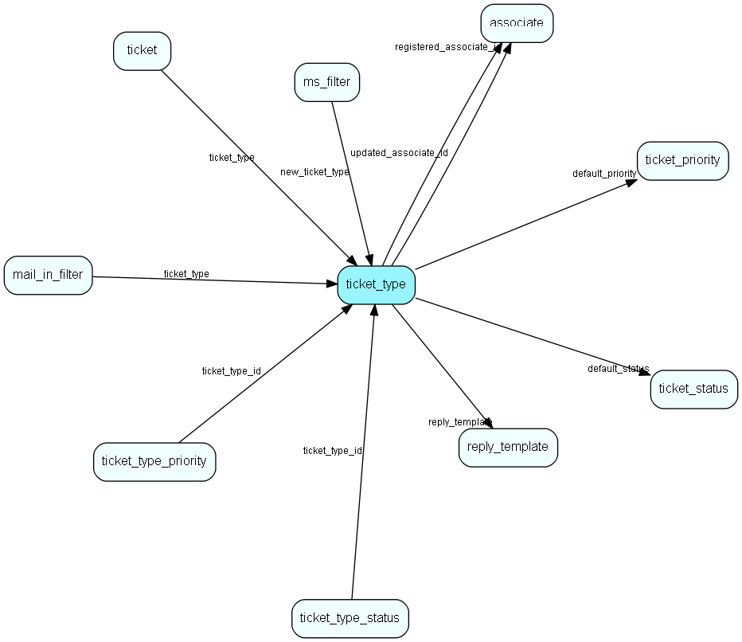

# ticket\_type Table (530)

A ticket (request) type

## Fields

| Name | Description | Type | Null |
|------|-------------|------|:----:|
|ticket\_type\_id|Primary key|PK| |
|name|The list item|String(4000)| |
|rank|Rank order|UShort|&#x25CF;|
|tooltip|Tooltip or other description|String(4000)|&#x25CF;|
|icon|Name of the icon|String(32)| |
|default\_status|Default ticket status for new tickets|FK [ticket_status](ticket-status.md)|&#x25CF;|
|default\_priority|Default ticket priority for new tickets|FK [ticket_priority](ticket-priority.md)|&#x25CF;|
|reply\_template|Reply template to use when replying to a ticket of this type|FK [reply_template](reply-template.md)|&#x25CF;|
|is\_external|Is this request type visible to external people and they can submit requests of this type|Bool|&#x25CF;|
|registered|Registered when|UtcDateTime| |
|registered\_associate\_id|Registered by whom|FK [associate](associate.md)| |
|updated|Last updated when|UtcDateTime| |
|updated\_associate\_id|Last updated by whom|FK [associate](associate.md)| |
|updatedCount|Number of updates made to this record|UShort| |
|is\_default|Is this Ticket Type marked as default|Bool|&#x25CF;|

[!include[details](./includes/ticket-type.md)]

## Indexes

| Fields | Types | Description |
|--------|-------|-------------|
|ticket\_type\_id |PK |Clustered, Unique |
|name |String(4000) |Unique |
|default\_status |FK |Index |
|default\_priority |FK |Index |
|reply\_template |FK |Index |

## Relationships

| Table|  Description |
|------|-------------|
|[associate](associate.md)  |Employees, resources and other users - except for External persons |
|[mail\_in\_filter](mail-in-filter.md)  |This table contains entries for the mailboxes the eJournal system is fetching mail from (POP3 or IMAP). |
|[ms\_filter](ms-filter.md)  |This table contains email filters. These are the filters allowing you to do advanced parsing of incomming emails. |
|[reply\_template](reply-template.md)  |Templates for automatic and manual replies to emails/sms organized hierachically |
|[ticket](ticket.md)  |This table contains the tickets (requests) of the system. Its purpose should be evident. |
|[ticket\_priority](ticket-priority.md)  |This table contains the ticket priorities. |
|[ticket\_status](ticket-status.md)  |This table user defined ticket status values. |
|[ticket\_type\_priority](ticket-type-priority.md)  |Link table defining what Priorities are relevant to a particular Ticket type |
|[ticket\_type\_status](ticket-type-status.md)  |Link table defining what Statuses are relevant to a particular Ticket type |

## Replication Flags

* None

## Security Flags

* No access control via user's Role.

