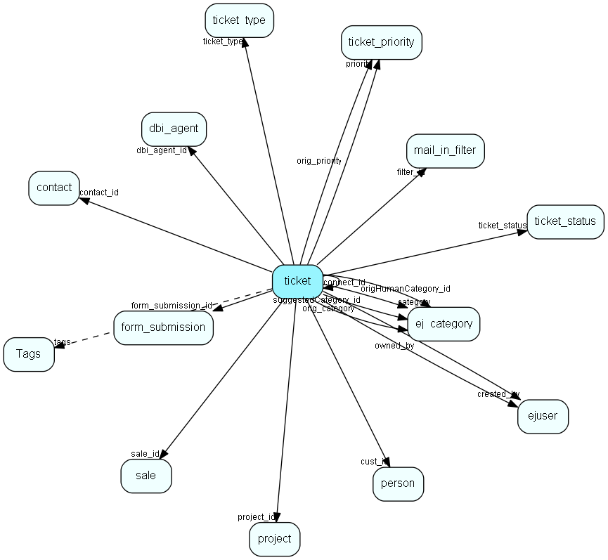

# ticket Table (262)

This table contains the tickets (requests) of the system. Its purpose should be evident.

## Fields

| Name | Description | Type | Null |
|------|-------------|------|:----:|
|id|The primary key (auto-incremented)|PK| |
|connect\_id|If a ticket is connected to another ticket, this field is set to the id of the &amp;apos;master&amp;apos; ticket.|FK [ticket](ticket.md)| |
|title|The title of the ticket.|String(255)| |
|created\_at|When the ticket was created.|DateTime| |
|last\_changed|The last time the ticket was modified.|DateTime|&#x25CF;|
|activate|When the ticket should be activated, if it is postponed.|DateTime|&#x25CF;|
|closed\_at|When the ticket was closed.|DateTime|&#x25CF;|
|created\_by|The id of the user who created the ticket. 1 (system user) if the ticket was created externally|FK [ejuser](ejuser.md)| |
|author|A string representing the author of the ticket (same as author of first message).|String(255)|&#x25CF;|
|owned\_by|The id of the user who owns the ticket. 1 (system user) if the ticket is unassigned.|FK [ejuser](ejuser.md)| |
|category|The id of the category a ticket is in.|FK [ej_category](ej-category.md)| |
|orig\_category|The id of the category the ticket was posted to.|FK [ej_category](ej-category.md)|&#x25CF;|
|slevel|The securitylevel of the ticket.|Enum [TicketSecurityLevel](enums/ticketsecuritylevel.md)|&#x25CF;|
|status|The status of the ticket. I.e. active/closed/postponed/deleted|Enum [TicketBaseStatus](enums/ticketbasestatus.md)| |
|ticket\_status|User defined ticket status|FK [ticket_status](ticket-status.md)| |
|cust\_id|The reference to the customer. NULL or -1 if ticket is not connected to customer.|FK [person](person.md)| |
|priority|The reference to the ticket_priority table.|FK [ticket_priority](ticket-priority.md)| |
|orig\_priority|The reference to the initial priority for the ticket.|FK [ticket_priority](ticket-priority.md)|&#x25CF;|
|alert\_level|The alert level for the ticket. Matches the level value of the ticket_alert table.|Short|&#x25CF;|
|alert\_timeout|The datetime for when the ticket should jump to the next alert_level.|DateTime|&#x25CF;|
|alert\_stop|If the esclatation was stopped, this fields indicates how many seconds left before the next escalation level. -1 if escalation is running.|Int| |
|read\_by\_owner|The datetime for when the ticket last was read by the owner.|DateTime|&#x25CF;|
|first\_read\_by\_owner|The datetime for when the ticket first was read by the current owner.|DateTime|&#x25CF;|
|first\_read\_by\_user|The datetime for when the ticket first was read by a user.|DateTime|&#x25CF;|
|read\_by\_customer|The datetime for when the ticket was read by the customer.|DateTime|&#x25CF;|
|filter\_id|The reference to the mailbox from which the ticket was created. NULL or -1 if the ticket was not created by a mailbox.|FK [mail_in_filter](mail-in-filter.md)| |
|display\_filter|The name of the mailbox from which the ticket was created. Only for displaypurposes|String(255)|&#x25CF;|
|replied\_at|The datetime for when the ticket was replied to. I.e. the first external message added to the ticket.|DateTime|&#x25CF;|
|time\_to\_reply|The time (minutes) between when the ticket was created and when it was replied to. Calculated based on priority&amp;apos;s timeframe.|Int|&#x25CF;|
|time\_to\_close|The time (minutes) between when the ticket was created and when it was closed. Calculated based on priority&amp;apos;s timeframe.|Int|&#x25CF;|
|real\_time\_to\_reply|Same as time_to_reply, but not calculated based on priority.|Int|&#x25CF;|
|real\_time\_to\_close|Same as time_to_close, but not calculated based on priority.|Int|&#x25CF;|
|read\_status|Whether the owner has read the ticket or not (red, yellow, green).|Enum [TicketReadStatus](enums/ticketreadstatus.md)| |
|has\_attachment|Boolean indicating if this ticket has one or more attachments.|Bool|&#x25CF;|
|deadline|Deadline for ticket.|DateTime|&#x25CF;|
|filter\_address|Address of receiving filter (mail box)|String(255)|&#x25CF;|
|dbi\_agent\_id|Integration agent (eJournal)|FK [dbi_agent](dbi-agent.md)| |
|dbi\_key|The primary key for the integrated entry in the external datasource.|String(255)| |
|dbi\_last\_syncronized|Last external synchronization.|DateTime| |
|dbi\_last\_modified|When the entry was last modified.|DateTime| |
|origin|What is the origin of this ticket|Enum [TicketOrigin](enums/ticketorigin.md)|&#x25CF;|
|time\_spent\_internally|The total time (seconds) within the priority&apos;s office hours the ticket has been in an open status (configurable), not including current state|Int|&#x25CF;|
|time\_spent\_externally|The total time (seconds) within the priority&apos;s office hours the ticket has been in a external waiting status (configurable), not including current state|Int|&#x25CF;|
|time\_spent\_queue|The total time (seconds) within the priority&apos;s office hours the ticket has been in a queue status, not including current state|Int|&#x25CF;|
|real\_time\_spent\_internally|The total time (seconds) within 24x7 the ticket has been in an open status (configurable), not including current state|Int|&#x25CF;|
|real\_time\_spent\_externally|The total time (seconds) within 24x7 the ticket has been in a external waiting status (configurable), not including current state|Int|&#x25CF;|
|real\_time\_spent\_queue|The total time (seconds) within 24x7 hours the ticket has been in a queue status, not including current state|Int|&#x25CF;|
|time\_spent\_calculated|When the time_spent value was last calculated.|DateTime|&#x25CF;|
|num\_replies|The number of replies (messages) to the customer for this request.|Int|&#x25CF;|
|num\_messages|The total number of messages for this request.|Int|&#x25CF;|
|from\_address|The from-address used when this ticket got created, e.g. by email|String(4000)|&#x25CF;|
|tags|Array of references to the Tags records|FKArray|&#x25CF;|
|contact\_id|The company of the person in the cust_id field, if that person belongs to a company|FK [contact](contact.md)|&#x25CF;|
|language|The language of the first external message|String(10)|&#x25CF;|
|sentiment|The sentiment index of the last external message|Int|&#x25CF;|
|sentimentConfidence|The sentiment confidence of the last external message|Int|&#x25CF;|
|form\_submission\_id|If this ticket was created from a form submission, this field will point to that record|FK [form_submission](form-submission.md)|&#x25CF;|
|created\_by\_workflow\_id|The workflow this request/ticket was created by|FK [workflow](workflow.md)|&#x25CF;|
|suggestedCategory\_id|Suggestion for categorization, based on the text of the message (AI)|FK [ej_category](ej-category.md)| |
|origHumanCategory\_id|Will contain the category id selected by the user, when having the choice of using the suggested category or manually selecting a category|FK [ej_category](ej-category.md)| |
|sale\_id|Reference to sale table|FK [sale](sale.md)|&#x25CF;|
|project\_id|Reference to project table|FK [project](project.md)|&#x25CF;|
|time\_spent|The total time (minutes). Aggregated time spent from ticket&amp;apos;s messages. Read-only for external use.|Int| |
|ticket\_type|Tickettype of the ticket|FK [ticket_type](ticket-type.md)| |

[!include[details](./includes/ticket.md)]

## Indexes

| Fields | Types | Description |
|--------|-------|-------------|
|id |PK |Clustered, Unique |
|connect\_id |FK |Index |
|created\_at |DateTime |Index |
|created\_by |FK |Index |
|owned\_by |FK |Index |
|category |FK |Index |
|orig\_category |FK |Index |
|status |Enum |Index |
|ticket\_status |FK |Index |
|cust\_id |FK |Index |
|priority |FK |Index |
|orig\_priority |FK |Index |
|alert\_timeout |DateTime |Index |
|filter\_id |FK |Index |
|read\_status |Enum |Index |
|dbi\_agent\_id |FK |Index |
|dbi\_key |String(255) |Index |
|dbi\_last\_syncronized |DateTime |Index |
|dbi\_last\_modified |DateTime |Index |
|tags |FKArray |Full text |
|created\_by\_workflow\_id |FK |Index |
|ticket\_type |FK |Index |

## Relationships

| Table|  Description |
|------|-------------|
|[chat\_session](chat-session.md)  |This table contains chat sessions. |
|[contact](contact.md)  |Companies and Organizations.   This table features a special record containing information about the contact that owns the database.   |
|[dbi\_agent](dbi-agent.md)  |DBI agent settings |
|[ej\_category](ej-category.md)  |This table contains categories, in which tickets are categorized. The categories are organized in a hierarchial manner. |
|[ej\_message](ej-message.md)  |This table contains the messages listed under tickets. |
|[ejuser](ejuser.md)  |This table contains entries for the users of the system. |
|[form\_submission](form-submission.md)  |A form submission |
|[hotlist](hotlist.md)  |The table is used by the hotlist to store the relationship between tickets and users |
|[mail\_in\_filter](mail-in-filter.md)  |This table contains entries for the mailboxes the eJournal system is fetching mail from (POP3 or IMAP). |
|[notify](notify.md)  |This table contains the pop-up messages displayed for users for various events, such as &amp;apos;new ticket&amp;apos;, etc. |
|[outbox](outbox.md)  |Outgoing emails with sending status and other info |
|[person](person.md)  |Persons in a company or an organizations. All associates have a corresponding person record |
|[project](project.md)  |Projects |
|[s\_shipment\_addr](s-shipment-addr.md)  |Addresses that are ready to be sent in a shipment. |
|[sale](sale.md)  |Sales  For every Sale record edited through the SuperOffice GUI, a copy of the current version of the record will be saved in the SaleHist table. This also applies to editing done through the SaleModel COM interface, but not to editing done through the OLE DB Provider or other channels.   |
|[Tags](tags.md)  |MDO List of tags for Service entities |
|[ticket](ticket.md)  |This table contains the tickets (requests) of the system. Its purpose should be evident. |
|[ticket\_customers](ticket-customers.md)  |This table allows several customers to be connected to several tickets (many-to-many) |
|[ticket\_log](ticket-log.md)  |This table contains log entries for the tickets. |
|[ticket\_log\_action](ticket-log-action.md)  |This table contains actions for the tickets. |
|[ticket\_log\_change](ticket-log-change.md)  |This table contains log entries for the tickets. |
|[ticket\_priority](ticket-priority.md)  |This table contains the ticket priorities. |
|[ticket\_status](ticket-status.md)  |This table user defined ticket status values. |
|[ticket\_status\_history](ticket-status-history.md)  |This table contains the history of a tickets statuses. Each time a ticket changes status a copy of the previous status of the record will be saved  |
|[ticket\_type](ticket-type.md)  |A ticket (request) type |
|[workflow](workflow.md)  |SuperOffice specific info about a workflow |

## Replication Flags

* None

## Security Flags

* Sentry controls access to items in this table using user's Role and data rights matrix.

