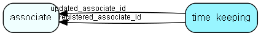

# time\_keeping Table (501)

Time keeping for how much time a sale or project or other entity has spent in a given stage or other state

## Fields

| Name | Description | Type | Null |
|------|-------------|------|:----:|
|time\_keeping\_id|Primary key|PK| |
|time\_keeping\_type|What we are keeping time of|Enum [TimeKeepingType](enums/timekeepingtype.md)|&#x25CF;|
|state\_id|The id of the state we are keeping time of (a sale stage, or other thing - given by time_keeping_type)|Int|&#x25CF;|
|start\_time|When the time keeping started for the last change, not yet finished/accumulated - The time since start_time must be added to the accumulation of time. When accumulation is done start_time will be set to the minimum value. start_time &gt; min implies this is the current state (stage).|DateTime|&#x25CF;|
|accumulated\_minutes|The previously accumulated time in minutes for the given state|Int|&#x25CF;|
|registered|Registered when|UtcDateTime| |
|registered\_associate\_id|Registered by whom|FK [associate](associate.md)| |
|updated|Last updated when|UtcDateTime| |
|updated\_associate\_id|Last updated by whom|FK [associate](associate.md)| |
|updatedCount|Number of updates made to this record|UShort| |
|ownerTable|The table that is the owning entity|TableNumber| |
|ownerRecord|Optional owner record id, if layout is bound to an owner|RecordId|&#x25CF;|

[!include[details](./includes/time-keeping.md)]

## Indexes

| Fields | Types | Description |
|--------|-------|-------------|
|time\_keeping\_id |PK |Clustered, Unique |
|ownerRecord, state\_id, time\_keeping\_type |RecordId, Int, Enum |Index |

## Relationships

| Table|  Description |
|------|-------------|
|[associate](associate.md)  |Employees, resources and other users - except for External persons |

## Replication Flags

* None

## Security Flags

* No access control via user's Role.

