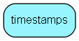

# timestamps Table (300)

Timestamp information

## Fields

| Name | Description | Type | Null |
|------|-------------|------|:----:|
|id|The primary key (auto-incremented)|PK| |
|mail\_filter|Timestamp for the last time importMail was started.|DateTime|&#x25CF;|
|mail\_sender|Timestamp for the last time mailSender was started.|DateTime|&#x25CF;|
|ejournal\_cron|Timestamp for the last time ejournalCron was started.|DateTime|&#x25CF;|
|autologout|Timestamp for when users should be checked for automatic logout.|DateTime|&#x25CF;|
|activate\_tickets|Timestamp for when tickets should be checked for activation.|DateTime|&#x25CF;|
|ticket\_alert|Timestamp for when tickets should be checked for escalation.|DateTime|&#x25CF;|
|delete\_temp\_ticket|Timestamp for when tickets should be checked for deletion.|DateTime|&#x25CF;|
|active\_tickets||DateTime|&#x25CF;|
|critical\_email|Timestamp for when we last emailed a critical email to panic_email (usually error@superoffice.com).|DateTime|&#x25CF;|
|last\_ticketdel|Timestamp for when we last physically removed tickets tagged for deletion.|DateTime|&#x25CF;|
|build\_faq|Timestamp for when the FAQ search tree was last rebuilt.|DateTime|&#x25CF;|
|week\_stat|Timestamp for when the week statistics was last sent.|DateTime|&#x25CF;|
|mailsync|Timestamp for syncing crm inbox2 email accounts|DateTime|&#x25CF;|

[!include[details](./includes/timestamps.md)]

## Indexes

| Fields | Types | Description |
|--------|-------|-------------|
|id |PK |Clustered, Unique |

## Replication Flags

* None

## Security Flags

* No access control via user's Role.

