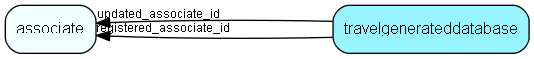

# travelgenerateddatabase Table (33)

Information about all databases generated from this database

## Fields

| Name | Description | Type | Null |
|------|-------------|------|:----:|
|travelgenerateddatabase\_id|Primary key|PK| |
|databasetype|Watcom, c-tree, Gupta etc.|UShort|&#x25CF;|
|area\_id|Central=0, Departm.=H01000000-H7F000000, Travel=assoc_id|Id|&#x25CF;|
|lastLogId|Last transaction log record (inclusive) covered by this prototype|Id|&#x25CF;|
|generatedtime|Generation timestamp|DateTime|&#x25CF;|
|state|0 = ready for use; 65535 = being generated, 1 - 65534 = downloadcount|UShort|&#x25CF;|
|dbTag|128-bit database tag of generated database|String(39)|&#x25CF;|
|registered|Registered when|UtcDateTime| |
|registered\_associate\_id|Registered by whom|FK [associate](associate.md)| |
|updated|Last updated when|UtcDateTime| |
|updated\_associate\_id|Last updated by whom|FK [associate](associate.md)| |
|updatedCount|Number of updates made to this record|UShort| |

[!include[details](./includes/travelgenerateddatabase.md)]

## Indexes

| Fields | Types | Description |
|--------|-------|-------------|
|travelgenerateddatabase\_id |PK |Clustered, Unique |

## Relationships

| Table|  Description |
|------|-------------|
|[associate](associate.md)  |Employees, resources and other users - except for External persons |

## Replication Flags

* None

## Security Flags

* No access control via user's Role.

