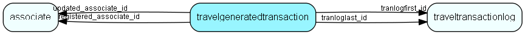

# travelgeneratedtransaction Table (30)

Record of all generated replication data files from this database (*.dwn files from mother database to child, *.up from child database to mother)

## Fields

| Name | Description | Type | Null |
|------|-------------|------|:----:|
|travelgeneratedtransaction\_id|Primary key|PK| |
|travel\_id|Central=0, Departm.=H01000000-H7F000000, Travel=assoc_id|Id|&#x25CF;|
|tranlogfirst\_id|This up/dwnfile holds transaction from traveltransactionlog_id = this number|FK [traveltransactionlog](traveltransactionlog.md)|&#x25CF;|
|tranloglast\_id|This up/dwnfile holds transaction to traveltransactionlog_id = this number|FK [traveltransactionlog](traveltransactionlog.md)|&#x25CF;|
|recordstatus|gen, sent, ack.|UShort|&#x25CF;|
|transmissionnumber|sequence pr. user|UInt|&#x25CF;|
|transmissiontype|File or direct communication|UShort|&#x25CF;|
|registered|Registered when|UtcDateTime| |
|registered\_associate\_id|Registered by whom|FK [associate](associate.md)| |
|updated|Last updated when|UtcDateTime| |
|updated\_associate\_id|Last updated by whom|FK [associate](associate.md)| |
|updatedCount|Number of updates made to this record|UShort| |

[!include[details](./includes/travelgeneratedtransaction.md)]

## Indexes

| Fields | Types | Description |
|--------|-------|-------------|
|travelgeneratedtransaction\_id |PK |Clustered, Unique |
|travel\_id |Id |Index |
|transmissionnumber, travel\_id |UInt, Id |Index |

## Relationships

| Table|  Description |
|------|-------------|
|[associate](associate.md)  |Employees, resources and other users - except for External persons |
|[traveltransactionlog](traveltransactionlog.md)  |Log of all updates made to the database, that need to be replicated. |

## Replication Flags

* None

## Security Flags

* No access control via user's Role.

