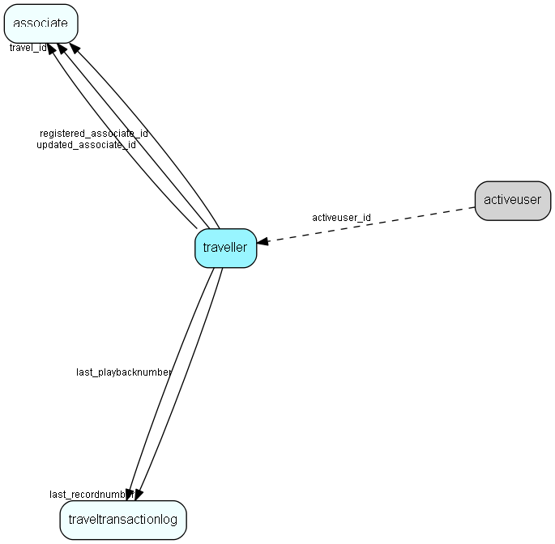

# traveller Table (31)

Associates traveling out from this database

## Fields

| Name | Description | Type | Null |
|------|-------------|------|:----:|
|traveller\_id|Primary key|PK| |
|systemlevel|level in hierarchy|UShort|&#x25CF;|
|travel\_id|Central=0, Departm.=H01000000-H7F000000, Travel=assoc_id|FK [associate](associate.md)|&#x25CF;|
|area\_id|ID of Area this traveller is on|Id|&#x25CF;|
|generatedtime|Time of exit (local update)|DateTime|&#x25CF;|
|last\_recordtime|Datestamp from last traveltrans record read from this traveller (async)|DateTime|&#x25CF;|
|last\_recordnumber|Record ID of last traveltranslog record receieved from this traveller|FK [traveltransactionlog](traveltransactionlog.md)|&#x25CF;|
|last\_playbacktime|Datetime when we last read a file from this traveller|DateTime|&#x25CF;|
|last\_playbacknumber|File number of last file receieved from this traveller|FK [traveltransactionlog](traveltransactionlog.md)|&#x25CF;|
|databasetype|The database type he has|UShort|&#x25CF;|
|encryptedComm|Use encrypted communication for this traveller: 0 = no, 1 = serial no as key, 2 = target db tag as key (secure but lots of hassle for support)|Enum [TravelEncryptionChild](enums/travelencryptionchild.md)|&#x25CF;|
|dbTag|Database tag, used for encryption key|String(39)|&#x25CF;|
|defaultMakeReturn|Default value for the &apos;make return log&apos; checkbox, based on last answer|UShort|&#x25CF;|
|registered|Registered when|UtcDateTime| |
|registered\_associate\_id|Registered by whom|FK [associate](associate.md)| |
|updated|Last updated when|UtcDateTime| |
|updated\_associate\_id|Last updated by whom|FK [associate](associate.md)| |
|updatedCount|Number of updates made to this record|UShort| |

[!include[details](./includes/traveller.md)]

## Indexes

| Fields | Types | Description |
|--------|-------|-------------|
|traveller\_id |PK |Clustered, Unique |

## Relationships

| Table|  Description |
|------|-------------|
|[activeuser](activeuser.md)  |Currently logged-on users. This table contains encrypted license information.  Changing it may disable login for all users and require intervention by SuperOffice support. Recommended use: for determining who is logged on, at what location, etc. |
|[associate](associate.md)  |Employees, resources and other users - except for External persons |
|[traveltransactionlog](traveltransactionlog.md)  |Log of all updates made to the database, that need to be replicated. |

## Replication Flags

* None

## Security Flags

* No access control via user's Role.

