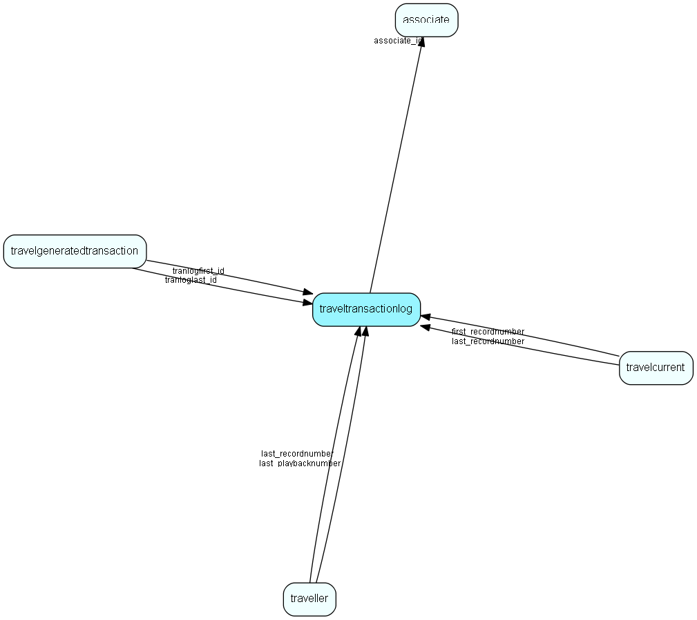

# traveltransactionlog Table (29)

Log of all updates made to the database, that need to be replicated.

## Fields

| Name | Description | Type | Null |
|------|-------------|------|:----:|
|traveltransactionlog\_id|Primary key|PK| |
|ttime|Time/datestamp of event|DateTime| |
|prev\_record\_id|Additional information|Id| |
|type|Type of event|Enum [TrlogTransType](enums/trlogtranstype.md)| |
|associate\_id|Who did it|FK [associate](associate.md)| |
|tablenumber|Table that was updated|TableNumber| |
|record\_id|Record that was updated|RecordId| |
|flags|Extra information about the operation, as a bit-masked field|Enum [TtlFlags](enums/ttlflags.md)|&#x25CF;|
|application\_id|ID of the application/client/owner of the context in which this record was written. This is primarily an Online feature, but the value int.MaxValue denotes the Win client|Int|&#x25CF;|

[!include[details](./includes/traveltransactionlog.md)]

## Indexes

| Fields | Types | Description |
|--------|-------|-------------|
|traveltransactionlog\_id |PK |Clustered, Unique |
|ttime |DateTime |Index |
|tablenumber, record\_id |TableNumber, RecordId |Index |
|type, tablenumber, traveltransactionlog\_id |Enum, TableNumber, PK |Index |

## Relationships

| Table|  Description |
|------|-------------|
|[associate](associate.md)  |Employees, resources and other users - except for External persons |
|[travelcurrent](travelcurrent.md)  |Information about this database and its place in the hierarchy |
|[travelgeneratedtransaction](travelgeneratedtransaction.md)  |Record of all generated replication data files from this database (*.dwn files from mother database to child, *.up from child database to mother) |
|[traveller](traveller.md)  |Associates traveling out from this database |

## Replication Flags

* None

## Security Flags

* No access control via user's Role.

