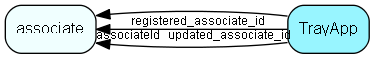

# TrayApp Table (252)

Tray application presence. SuperOffice CRM web extensions.

## Fields

| Name | Description | Type | Null |
|------|-------------|------|:----:|
|TrayApp\_id|Primary key|PK| |
|associateId|Associate id that the tray app is being detected for|FK [associate](associate.md)| |
|pageGenerated|When was the web page generated that contained the trayapp link|DateTime| |
|presenceDetected|When was the presence last detected|DateTime|&#x25CF;|
|guid|TrayApp unique GUID included in presence detection link|String(253)| |
|lcid|Language ID passed to tray app|Id|&#x25CF;|
|registered|Registered when|UtcDateTime| |
|registered\_associate\_id|Registered by whom|FK [associate](associate.md)| |
|updated|Last updated when|UtcDateTime| |
|updated\_associate\_id|Last updated by whom|FK [associate](associate.md)| |
|updatedCount|Number of updates made to this record|UShort| |

[!include[details](./includes/trayapp.md)]

## Indexes

| Fields | Types | Description |
|--------|-------|-------------|
|TrayApp\_id |PK |Clustered, Unique |
|associateId |FK |Index |
|guid |String(253) |Unique |

## Relationships

| Table|  Description |
|------|-------------|
|[associate](associate.md)  |Employees, resources and other users - except for External persons |

## Replication Flags

* None

## Security Flags

* No access control via user's Role.

