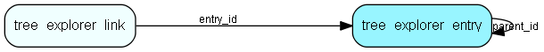

# tree\_explorer\_entry Table (399)

This table stores the entries in a tree-explorer

## Fields

| Name | Description | Type | Null |
|------|-------------|------|:----:|
|id|Primary key|PK| |
|parent\_id|The parent id of the entry|FK [tree_explorer_entry](tree-explorer-entry.md)| |
|name|The name of the entry|String(255)| |
|icon|The icon of the entry|String(255)|&#x25CF;|
|onclick|The onclick action of the entry|String(255)|&#x25CF;|
|href|The href of the entry|String(255)|&#x25CF;|
|tooltip|The tooltip of the entry|Clob|&#x25CF;|
|target|The target of the href of the entry|String(255)|&#x25CF;|
|sort\_order|The order of the entry|Int|&#x25CF;|
|leaf|True if the entry is a leaf node|Bool|&#x25CF;|
|session\_key|The session this entry belongs to|String(255)|&#x25CF;|
|expand\_order|If &amp;gt; 0 then expanded and insertorder for the tree|Int|&#x25CF;|
|tree\_key|The key used for reloading|String(255)|&#x25CF;|
|internal\_id|The internal id for the tree|String(255)|&#x25CF;|
|internal\_parent|The internal parent id for the tree|String(255)|&#x25CF;|

[!include[details](./includes/tree-explorer-entry.md)]

## Indexes

| Fields | Types | Description |
|--------|-------|-------------|
|id |PK |Clustered, Unique |
|parent\_id |FK |Index |
|session\_key |String(255) |Index |
|expand\_order |Int |Index |
|tree\_key |String(255) |Index |

## Relationships

| Table|  Description |
|------|-------------|
|[tree\_explorer\_entry](tree-explorer-entry.md)  |This table stores the entries in a tree-explorer |
|[tree\_explorer\_link](tree-explorer-link.md)  |This table stores the link of entries in a tree-explorer |

## Replication Flags

* None

## Security Flags

* No access control via user's Role.

