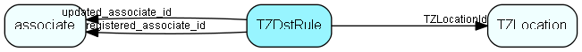

# TZDstRule Table (247)

Time zone rule for daylight saving time

## Fields

| Name | Description | Type | Null |
|------|-------------|------|:----:|
|TZDstRule\_id|Primary key|PK| |
|TZLocationId|Location that this rule is valid for - one location may have one or more rules; multiple rules are discerned by their validFrom dates|FK [TZLocation](tzlocation.md)| |
|validFrom|Date this rule is valid from|DateTime| |
|bias|number of minutes bias relative to UTC time|Short| |
|startRule|DST start rule, such as 0200 1ST-SUN-APR; limited to rules that we have parse code for; use dayOfMonth etc for custom rules|String(254)|&#x25CF;|
|endRule|DST end rule, such as 2300 LST-SAT-OCT; limited to rules that we have parse code for; use dayOfMonth etc for custom rules|String(254)|&#x25CF;|
|startDayOfMonth|Custom DST start day, if 0 then parse startRule|UShort|&#x25CF;|
|startMonth|Custom DST start month, if 0 then parse startRule|UShort| |
|endDayOfMonth|Custom DST end day, if 0 then parse endRule|UShort| |
|endMonth|Custom DST end month, if 0 then parse endRule|UShort| |
|description|Description, for identifying the rule in SoAdmin|String(2047)|&#x25CF;|
|isBuiltIn|Is this row part of SuperOffice priming data|Bool|&#x25CF;|
|registered|Registered when|UtcDateTime| |
|registered\_associate\_id|Registered by whom|FK [associate](associate.md)| |
|updated|Last updated when|UtcDateTime| |
|updated\_associate\_id|Last updated by whom|FK [associate](associate.md)| |
|updatedCount|Number of updates made to this record|UShort| |

[!include[details](./includes/tzdstrule.md)]

## Indexes

| Fields | Types | Description |
|--------|-------|-------------|
|TZDstRule\_id |PK |Clustered, Unique |
|TZLocationId |FK |Index |

## Relationships

| Table|  Description |
|------|-------------|
|[associate](associate.md)  |Employees, resources and other users - except for External persons |
|[TZLocation](tzlocation.md)  |Time zone location |

## Replication Flags

* Replicate changes DOWN from central to satellites and travellers.
* Replicate changes UP from satellites and travellers back to central.
* Copy to satellite and travel prototypes.

## Security Flags

* No access control via user's Role.

