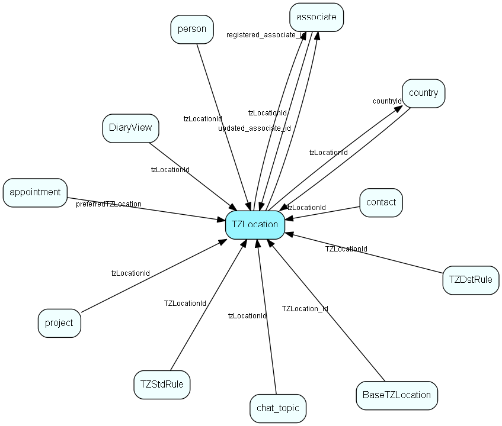

# TZLocation Table (245)

Time zone location

## Fields

| Name | Description | Type | Null |
|------|-------------|------|:----:|
|TZLocation\_id|Primary key|PK| |
|countryId|Country that this timezone location is defined for|FK [country](country.md)| |
|locationCode|Code, such as CA-NT, identifying the timezone location in the imported data. Unique, NOT equal to the culture codes of Windows|String(29)| |
|groupName|Group (heading) name for timezone locations that do not have a country (such as the EU zones)|String(254)|&#x25CF;|
|regionName|Name of region, such as Northwest Territories. Future localization via localeText resource type 31|String(254)| |
|cities|Cities, comma-separated list. Future localization via localeText resource type 32|String(2047)| |
|shortName|Short name, such as CET (Central European Time); future localization via localeText resource type 33|String(254)| |
|description|Dcescription, only visible in Admin contexts|String(254)|&#x25CF;|
|isBuiltIn|Is this row part of SuperOffice priming data|Bool|&#x25CF;|
|isActive|Is this field visible in the standard drop-down list in the GUI? If no, it can still be used and searched for, but won&apos;t be visible directly in the dropdown list.|Bool|&#x25CF;|
|isDeleted|Is this row &apos;deleted&apos; (invisible in lists)|Bool|&#x25CF;|
|registered|Registered when|UtcDateTime| |
|registered\_associate\_id|Registered by whom|FK [associate](associate.md)| |
|updated|Last updated when|UtcDateTime| |
|updated\_associate\_id|Last updated by whom|FK [associate](associate.md)| |
|updatedCount|Number of updates made to this record|UShort| |

[!include[details](./includes/tzlocation.md)]

## Indexes

| Fields | Types | Description |
|--------|-------|-------------|
|TZLocation\_id |PK |Clustered, Unique |
|locationCode |String(29) |Unique |

## Relationships

| Table|  Description |
|------|-------------|
|[appointment](appointment.md)  |Tasks, appointments, followups, phone calls; and documents (document_id != 0). An appointment always has a corresponding record in VisibleFor specifying who may see this.  |
|[associate](associate.md)  |Employees, resources and other users - except for External persons |
|[BaseTZLocation](basetzlocation.md)  |Time zone location for the database (how tz-related datetimes should be stored in the database) |
|[chat\_topic](chat-topic.md)  |This table contains chat topics. |
|[contact](contact.md)  |Companies and Organizations.   This table features a special record containing information about the contact that owns the database.   |
|[country](country.md)  |Country information |
|[DiaryView](diaryview.md)  |Configuration of a multi-user diary view |
|[person](person.md)  |Persons in a company or an organizations. All associates have a corresponding person record |
|[project](project.md)  |Projects |
|[TZDstRule](tzdstrule.md)  |Time zone rule for daylight saving time |
|[TZStdRule](tzstdrule.md)  |Time zone rule for standard time |
|[workflow](workflow.md)  |SuperOffice specific info about a workflow |

## Replication Flags

* Replicate changes DOWN from central to satellites and travellers.
* Replicate changes UP from satellites and travellers back to central.
* Copy to satellite and travel prototypes.

## Security Flags

* No access control via user's Role.

