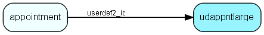

# udappntlarge Table (229)

User-defined fields

## Fields

| Name | Description | Type | Null |
|------|-------------|------|:----:|
|udappntlarge\_id|Primary key|PK| |
|string41|string value 41, indexed|String(199)|&#x25CF;|
|string42|string value 42,  indexed|String(199)|&#x25CF;|
|string43|string value 43, indexed|String(199)|&#x25CF;|
|string44|string value 44, indexed|String(199)|&#x25CF;|
|string45|string value 45, not indexed|String(199)|&#x25CF;|
|string46|string value 46, not indexed|String(199)|&#x25CF;|
|string47|string value 47, not indexed|String(199)|&#x25CF;|
|string48|string value 48, not indexed|String(199)|&#x25CF;|
|string49|string value 49, not indexed|String(199)|&#x25CF;|

[!include[details](./includes/udappntlarge.md)]

## Indexes

| Fields | Types | Description |
|--------|-------|-------------|
|udappntlarge\_id |PK |Clustered, Unique |
|string41 |String(199) |Index |
|string42 |String(199) |Index |
|string43 |String(199) |Index |
|string44 |String(199) |Index |

## Relationships

| Table|  Description |
|------|-------------|
|[appointment](appointment.md)  |Tasks, appointments, followups, phone calls; and documents (document_id != 0). An appointment always has a corresponding record in VisibleFor specifying who may see this.  |

## Replication Flags

* Area Management controlled table. Contents replicated to satellites and traveller databases.
* Replicate changes UP from satellites and travellers back to central.
* Copy to satellite and travel prototypes.

## Security Flags

* No access control via user's Role.

