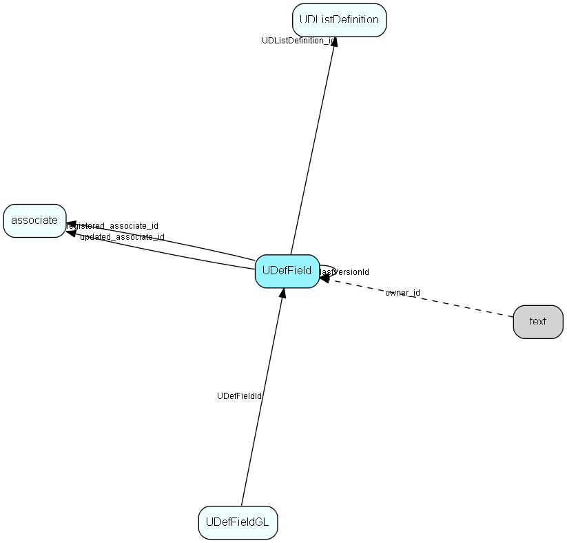

# UDefField Table (146)

Definition table for user-defined fields; one row in this table corresponds to one generation of one field. The user defined fields that are in use, and earlier versions of user defined fields. ColumnId refers to the field type; see UDXXXSmall or UDXXXLarge for the referring ID.  Preferences prefsection=&apos;System&apos;, prefkey=&apos;CurrentUdefVersioncontact&apos;  (or CurrentUdefVersionperson, project, sale), gives you the current version of user defined fields.  prefkey=&apos;AdminUdefVersion&lt;...&gt;&apos; gives you the current version that&apos;s being edited. If Current version = admin version, no editing has been done since the last Publish of user defined field was performed.

## Fields

| Name | Description | Type | Null |
|------|-------------|------|:----:|
|UDefField\_Id|Primary key|PK| |
|ownerTable\_id|ID of owning table (contact, person, project) - this is not the actual tableNumber, rather it&apos;s an enum|UShort| |
|tabOrder|Tab order value, sets the field processing sequence|UShort| |
|fieldType|Field type: 0 = leadtext only, 1 = Edit, 2 = CheckBox, 3 = dropdown, 4 = listbox|UShort| |
|listTableId|The table ID of the source table for lists: kTableAssoc, kTableContInt or whatever|TableNumber|&#x25CF;|
|UDListDefinition\_id|List to use for populating dropdown or listbox|FK [UDListDefinition](udlistdefinition.md)| |
|columnId|The ID of the database column this field corresponds to|FieldId| |
|textLength|Length (in characters) of a text field, 0 for other types|UShort|&#x25CF;|
|fieldDefault|Optional default value for String fields|String(254)|&#x25CF;|
|indexed|Is this field indexed? 0 if no, index no. if yes|Bool|&#x25CF;|
|mandatory|0 = no, 1 = yes (field must be filled out)|Bool| |
|readOnly|0 = read/write, 1 = readonly (don&apos;t combine with mandatory  8-) )|UShort|&#x25CF;|
|tooltip|Optional tooltip text for this field|String(254)|&#x25CF;|
|fieldLabel|The label (lead text)|String(254)|&#x25CF;|
|labelLeft|X pixel coordinate of label|UShort|&#x25CF;|
|labelTop|Y pixel coordinate of label|UShort|&#x25CF;|
|labelWidth|label width in pixels, 0 = &apos;enough&apos; (from font)|UShort|&#x25CF;|
|labelHeight|label height in pixels, 0 = &apos;enough&apos; (from font)|UShort|&#x25CF;|
|fieldLeft|X pixel coordinate of field|UShort|&#x25CF;|
|fieldTop|Y pixel coordinate of field|UShort|&#x25CF;|
|fieldWidth|field width in pixels, 0 = &apos;enough&apos; (from font)|UShort|&#x25CF;|
|fieldHeight|field height in pixels, 0 = &apos;enough&apos; (from font)|UShort|&#x25CF;|
|version|Definition version number; ALL fields get new version whenever layout is updated.|UShort|&#x25CF;|
|lastVersionId|UDefFieldId this field had in the previous version, 0 = field is new in this version|FK [UDefField](udeffield.md)|&#x25CF;|
|page1LineNo|Line no on View Page 1, used if MDO flags are OFF. 0 = this field is not visible on page 1|UShort|&#x25CF;|
|registered|Registered when|UtcDateTime| |
|registered\_associate\_id|Registered by whom|FK [associate](associate.md)| |
|updated|Last updated when|UtcDateTime| |
|updated\_associate\_id|Last updated by whom|FK [associate](associate.md)| |
|updatedCount|Number of updates made to this record|UShort| |
|udefIdentity|Unique number used to track field identity across layout changes|Id|&#x25CF;|
|hideLabel|Hide the label if 1|Bool|&#x25CF;|
|justification|Justification - 0 = default, left, right, center|Enum [UdefJustification](enums/udefjustification.md)|&#x25CF;|
|progId|Programmatic ID, for use by software that needs to find a particular field. Carried over like udefIdentity across generations. Use a Company.Product.Field format to avoid naming conflicts; the Company name SuperOffice is reserved.|String(254)|&#x25CF;|
|formatMask|Formatting mask, can be whatever the controls understand (currently nothing :-))|String(254)|&#x25CF;|
|shortLabel|Short name to be used in Archive headings and on page 1. If blank, the fieldLabel will be used everywhere.|String(254)|&#x25CF;|

[!include[details](./includes/udeffield.md)]

## Indexes

| Fields | Types | Description |
|--------|-------|-------------|
|UDefField\_Id |PK |Clustered, Unique |
|ownerTable\_id |UShort |Index |

## Relationships

| Table|  Description |
|------|-------------|
|[associate](associate.md)  |Employees, resources and other users - except for External persons |
|[text](text.md)  |Long text fields from all over the system |
|[UDefField](udeffield.md)  |Definition table for user-defined fields; one row in this table corresponds to one generation of one field. The user defined fields that are in use, and earlier versions of user defined fields. ColumnId refers to the field type; see UDXXXSmall or UDXXXLarge for the referring ID.  Preferences prefsection=&apos;System&apos;, prefkey=&apos;CurrentUdefVersioncontact&apos;  (or CurrentUdefVersionperson, project, sale), gives you the current version of user defined fields.  prefkey=&apos;AdminUdefVersion&lt;...&gt;&apos; gives you the current version that&apos;s being edited. If Current version = admin version, no editing has been done since the last Publish of user defined field was performed. |
|[UDefFieldGL](udeffieldgl.md)  |User group link table for UDefField, for MDO item hiding |
|[UDListDefinition](udlistdefinition.md)  |List table that contains the list of user-defined lists, as well as system-defined lists. The list items are stored in the UDList table.  |

## Replication Flags

* Replicate changes DOWN from central to satellites and travellers.
* Copy to satellite and travel prototypes.

## Security Flags

* Sentry controls access to items in this table using user's Role and data rights matrix.

