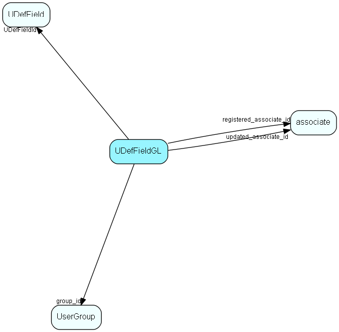

# UDefFieldGL Table (147)

User group link table for UDefField, for MDO item hiding

## Fields

| Name | Description | Type | Null |
|------|-------------|------|:----:|
|UDefFieldGL\_Id|Primary key|PK| |
|UDefFieldId|Link to field|FK [UDefField](udeffield.md)| |
|fieldLineNo|Line number in display, 1, 2, 3…|UShort| |
|group\_id|Link to Group table|FK [UserGroup](usergroup.md)| |
|registered|Registered when|UtcDateTime| |
|registered\_associate\_id|Registered by whom|FK [associate](associate.md)| |
|updated|Last updated when|UtcDateTime| |
|updated\_associate\_id|Last updated by whom|FK [associate](associate.md)| |
|updatedCount|Number of updates made to this record|UShort| |

[!include[details](./includes/udeffieldgl.md)]

## Indexes

| Fields | Types | Description |
|--------|-------|-------------|
|UDefFieldGL\_Id |PK |Clustered, Unique |
|UDefFieldId |FK |Index |
|group\_id |FK |Index |

## Relationships

| Table|  Description |
|------|-------------|
|[associate](associate.md)  |Employees, resources and other users - except for External persons |
|[UDefField](udeffield.md)  |Definition table for user-defined fields; one row in this table corresponds to one generation of one field. The user defined fields that are in use, and earlier versions of user defined fields. ColumnId refers to the field type; see UDXXXSmall or UDXXXLarge for the referring ID.  Preferences prefsection=&apos;System&apos;, prefkey=&apos;CurrentUdefVersioncontact&apos;  (or CurrentUdefVersionperson, project, sale), gives you the current version of user defined fields.  prefkey=&apos;AdminUdefVersion&lt;...&gt;&apos; gives you the current version that&apos;s being edited. If Current version = admin version, no editing has been done since the last Publish of user defined field was performed. |
|[UserGroup](usergroup.md)  |Secondary user groups |

## Replication Flags

* Replicate changes DOWN from central to satellites and travellers.
* Replicate changes UP from satellites and travellers back to central.
* Copy to satellite and travel prototypes.

## Security Flags

* No access control via user's Role.

