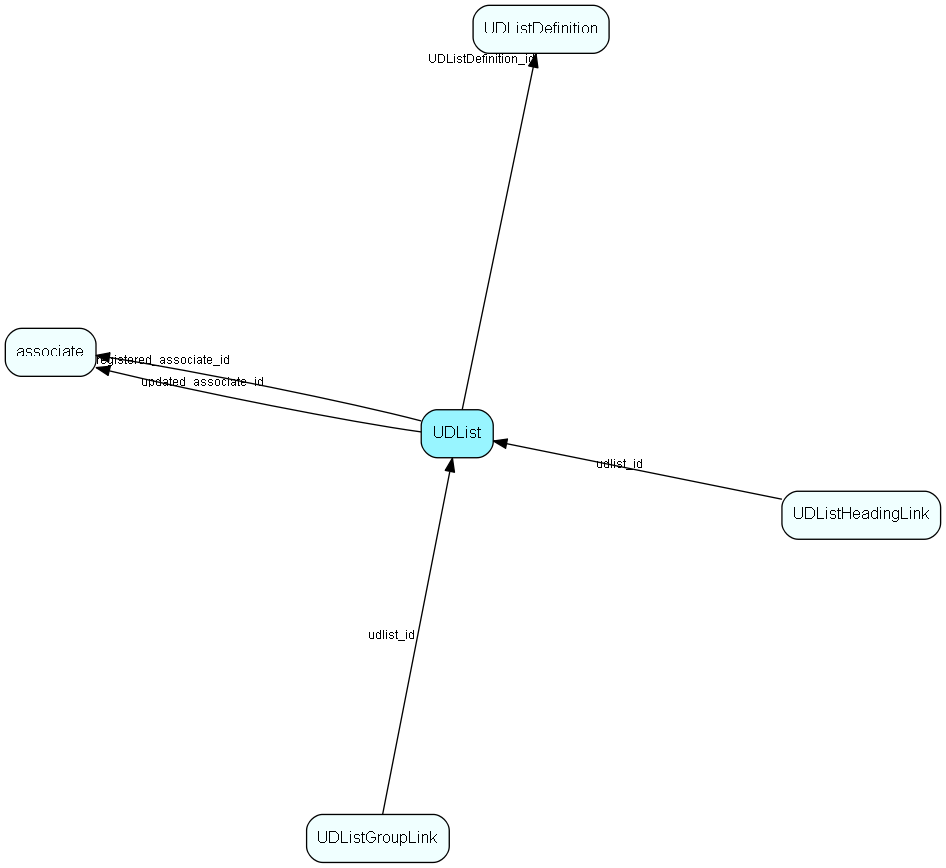

# UDList Table (136)

UDList MDO list item table.
List table for user-defined lists, contains all user-defined lists. Note - MDO mode for userdefinede lists are either turned on or off, you may not have it on for one userdefined list and off for the others.

## Fields

| Name | Description | Type | Null |
|------|-------------|------|:----:|
|UDList\_id|Primary key|PK| |
|name|The list item|String(239)| |
|rank|Rank order |UShort|&#x25CF;|
|tooltip|Tooltip or other description|String(254)|&#x25CF;|
|deleted|0 -&gt; record is active 1 -&gt; record is &apos;deleted&apos; and should not be shown in lists|UShort|&#x25CF;|
|UDListDefinition\_id|List to use for populating dropdown or listbox|FK [UDListDefinition](udlistdefinition.md)| |
|registered|Registered when|UtcDateTime| |
|registered\_associate\_id|Registered by whom|FK [associate](associate.md)| |
|updated|Last updated when|UtcDateTime| |
|updated\_associate\_id|Last updated by whom|FK [associate](associate.md)| |
|updatedCount|Number of updates made to this record|UShort| |

[!include[details](./includes/udlist.md)]

## Indexes

| Fields | Types | Description |
|--------|-------|-------------|
|UDList\_id |PK |Clustered, Unique |
|name |String(239) |Index |

## Relationships

| Table|  Description |
|------|-------------|
|[associate](associate.md)  |Employees, resources and other users - except for External persons |
|[UDListDefinition](udlistdefinition.md)  |List table that contains the list of user-defined lists, as well as system-defined lists. The list items are stored in the UDList table.  |
|[UDListGroupLink](udlistgrouplink.md)  |User group link table for UDList, for MDO item hiding. Note - MDO mode for userdefinede lists are either turned on or off, you may not have it on for one userdefined list and off for the others. |
|[UDListHeadingLink](udlistheadinglink.md)  |Heading link table for UDList, for MDO headers. Note - MDO mode for userdefinede lists are either turned on or off, you may not have it on for one userdefined list and off for the others. |

## Replication Flags

* Replicate changes DOWN from central to satellites and travellers.
* Replicate changes UP from satellites and travellers back to central.
* Copy to satellite and travel prototypes.

## Security Flags

* No access control via user's Role.

