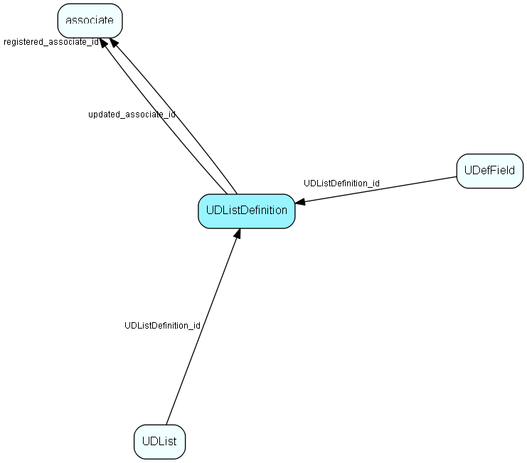

# UDListDefinition Table (139)

List table that contains the list of user-defined lists, as well as system-defined lists. The list items are stored in the UDList table. 

## Fields

| Name | Description | Type | Null |
|------|-------------|------|:----:|
|UDListDefinition\_id|Primary key|PK| |
|name|The list item|String(239)| |
|rank|Rank order|UShort|&#x25CF;|
|tooltip|Tooltip or other description|String(254)|&#x25CF;|
|deleted|0 -&gt; record is active 1 -&gt; record is &apos;deleted&apos; and should not be shown in lists|UShort|&#x25CF;|
|listTableId|The table ID of the list table that this record contains the name of|TableNumber| |
|registered|Registered when|UtcDateTime| |
|registered\_associate\_id|Registered by whom|FK [associate](associate.md)| |
|updated|Last updated when|UtcDateTime| |
|updated\_associate\_id|Last updated by whom|FK [associate](associate.md)| |
|updatedCount|Number of updates made to this record|UShort| |
|requiredLicense|Licenses the user/installation must have if this reference is to be shown. Comma-separated list of owner.module pairs|String(254)|&#x25CF;|

[!include[details](./includes/udlistdefinition.md)]

## Indexes

| Fields | Types | Description |
|--------|-------|-------------|
|UDListDefinition\_id |PK |Clustered, Unique |
|name |String(239) |Unique |

## Relationships

| Table|  Description |
|------|-------------|
|[associate](associate.md)  |Employees, resources and other users - except for External persons |
|[UDefField](udeffield.md)  |Definition table for user-defined fields; one row in this table corresponds to one generation of one field. The user defined fields that are in use, and earlier versions of user defined fields. ColumnId refers to the field type; see UDXXXSmall or UDXXXLarge for the referring ID.  Preferences prefsection=&apos;System&apos;, prefkey=&apos;CurrentUdefVersioncontact&apos;  (or CurrentUdefVersionperson, project, sale), gives you the current version of user defined fields.  prefkey=&apos;AdminUdefVersion&lt;...&gt;&apos; gives you the current version that&apos;s being edited. If Current version = admin version, no editing has been done since the last Publish of user defined field was performed. |
|[UDList](udlist.md)  |List table for user-defined lists, contains all user-defined lists. Note - MDO mode for userdefinede lists are either turned on or off, you may not have it on for one userdefined list and off for the others. |

## Replication Flags

* Replicate changes DOWN from central to satellites and travellers.
* Replicate changes UP from satellites and travellers back to central.
* Copy to satellite and travel prototypes.

## Security Flags

* No access control via user's Role.

