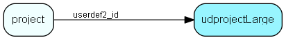

# udprojectLarge Table (143)

User-defined fields. During conversion of user defined fields the data is stored in this table.

## Fields

| Name | Description | Type | Null |
|------|-------------|------|:----:|
|udprojectLarge\_id|Primary key|PK| |
|string41|string value 41, indexed|String(199)|&#x25CF;|
|string42|string value 42,  indexed|String(199)|&#x25CF;|
|string43|string value 43, indexed|String(199)|&#x25CF;|
|string44|string value 44, indexed|String(199)|&#x25CF;|
|string45|string value 45, not indexed|String(199)|&#x25CF;|
|string46|string value 46, not indexed|String(199)|&#x25CF;|
|string47|string value 47, not indexed|String(199)|&#x25CF;|
|string48|string value 48, not indexed|String(199)|&#x25CF;|
|string49|string value 49, not indexed|String(199)|&#x25CF;|

[!include[details](./includes/udprojectlarge.md)]

## Indexes

| Fields | Types | Description |
|--------|-------|-------------|
|udprojectLarge\_id |PK |Clustered, Unique |
|string41 |String(199) |Index |
|string42 |String(199) |Index |
|string43 |String(199) |Index |
|string44 |String(199) |Index |

## Relationships

| Table|  Description |
|------|-------------|
|[project](project.md)  |Projects |

## Replication Flags

* Area Management controlled table. Contents replicated to satellites and traveller databases.
* Replicate changes UP from satellites and travellers back to central.
* Copy to satellite and travel prototypes.

## Security Flags

* Sentry controls access to items in this table using user's Role and data rights matrix on the table's parent.

