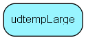

# udtempLarge Table (145)

User-defined fields

## Fields

| Name | Description | Type | Null |
|------|-------------|------|:----:|
|udtempLarge\_id|Primary key|PK| |
|string41|string value 41, indexed|String(199)|&#x25CF;|
|string42|string value 42,  indexed|String(199)|&#x25CF;|
|string43|string value 43, indexed|String(199)|&#x25CF;|
|string44|string value 44, indexed|String(199)|&#x25CF;|
|string45|string value 45, not indexed|String(199)|&#x25CF;|
|string46|string value 46, not indexed|String(199)|&#x25CF;|
|string47|string value 47, not indexed|String(199)|&#x25CF;|
|string48|string value 48, not indexed|String(199)|&#x25CF;|
|string49|string value 49, not indexed|String(199)|&#x25CF;|

[!include[details](./includes/udtemplarge.md)]

## Indexes

| Fields | Types | Description |
|--------|-------|-------------|
|udtempLarge\_id |PK |Clustered, Unique |

## Replication Flags

* None

## Security Flags

* No access control via user's Role.

