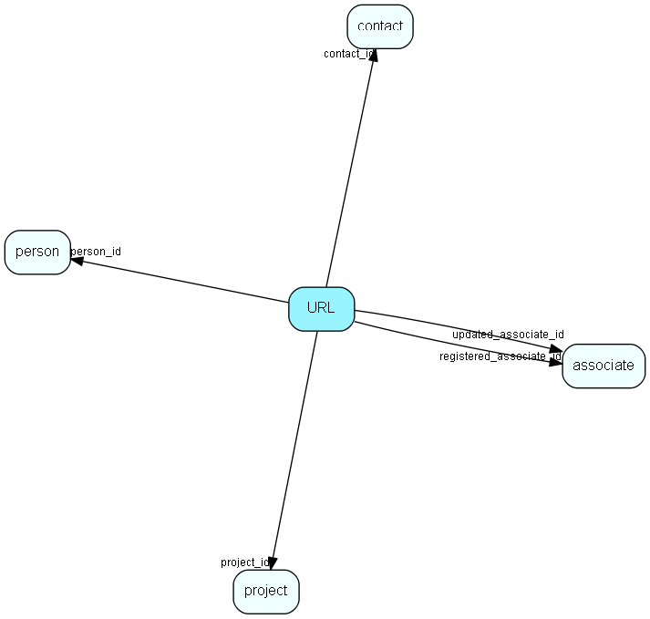

# URL Table (54)

Unified Resource Locators, URL to contacts, persons or projects.

## Fields

| Name | Description | Type | Null |
|------|-------------|------|:----:|
|url\_id|Primary key|PK| |
|contact\_id|Relations to possible owners|FK [contact](contact.md)|&#x25CF;|
|person\_id|Relations to possible owners|FK [person](person.md)|&#x25CF;|
|project\_id|Relations to possible owners|FK [project](project.md)|&#x25CF;|
|reserved\_id1|Reserved for potential future owners|Id|&#x25CF;|
|reserved\_id2|Reserved for potential future owners|Id|&#x25CF;|
|type|Fixed, predefined list of types|UShort| |
|description|Visible field|String(254)| |
|url\_address|URL address|String(1023)| |
|rank|Rank order in lists|UShort| |
|registered|Registered when|UtcDateTime| |
|registered\_associate\_id|Registered by whom|FK [associate](associate.md)| |
|updated|Last updated when|UtcDateTime| |
|updated\_associate\_id|Last updated by whom|FK [associate](associate.md)| |
|updatedCount|Number of updates made to this record|UShort| |

[!include[details](./includes/url.md)]

## Indexes

| Fields | Types | Description |
|--------|-------|-------------|
|url\_id |PK |Clustered, Unique |
|contact\_id |FK |Index |
|person\_id |FK |Index |
|project\_id |FK |Index |
|reserved\_id1 |Id |Index |
|reserved\_id2 |Id |Index |
|url\_address |String(1023) |Index |
|rank |UShort |Index |

## Relationships

| Table|  Description |
|------|-------------|
|[associate](associate.md)  |Employees, resources and other users - except for External persons |
|[contact](contact.md)  |Companies and Organizations.   This table features a special record containing information about the contact that owns the database.   |
|[person](person.md)  |Persons in a company or an organizations. All associates have a corresponding person record |
|[project](project.md)  |Projects |

## Replication Flags

* Area Management controlled table. Contents replicated to satellites and traveller databases.
* Replicate changes UP from satellites and travellers back to central.
* Copy to satellite and travel prototypes.

## Security Flags

* Sentry controls access to items in this table using user's Role and data rights matrix on the table's parent.

