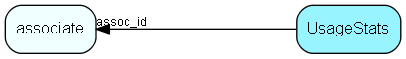

# UsageStats Table (190)

Usage statistics

## Fields

| Name | Description | Type | Null |
|------|-------------|------|:----:|
|UsageStats\_id|Primary key|PK| |
|assoc\_id|Optional associate, if collecting individual data|FK [associate](associate.md)|&#x25CF;|
|functionId|ID of function, internal enumeration type|Id| |
|subId|Optional sub-function id|Id|&#x25CF;|
|uses|Number of uses|UInt|&#x25CF;|
|data1|Data field|Int|&#x25CF;|
|data2|Data field|Int|&#x25CF;|
|data3|Data field|Int|&#x25CF;|
|data4|Data field|Int|&#x25CF;|
|data5|Data field|Int|&#x25CF;|

[!include[details](./includes/usagestats.md)]

## Indexes

| Fields | Types | Description |
|--------|-------|-------------|
|UsageStats\_id |PK |Clustered, Unique |
|assoc\_id |FK |Index |

## Relationships

| Table|  Description |
|------|-------------|
|[associate](associate.md)  |Employees, resources and other users - except for External persons |

## Replication Flags

* None

## Security Flags

* No access control via user's Role.

