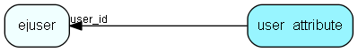

# user\_attribute Table (403)

This table is used for storing various attributes for users.

## Fields

| Name | Description | Type | Null |
|------|-------------|------|:----:|
|id|The primary key (auto-incremented)|PK| |
|user\_id|The user associated with this attribute.|FK [ejuser](ejuser.md)| |
|att\_key|An identifying string key for the entry|String(255)| |
|att\_value|The value of the attribute.|Clob|&#x25CF;|

[!include[details](./includes/user-attribute.md)]

## Indexes

| Fields | Types | Description |
|--------|-------|-------------|
|id |PK |Clustered, Unique |
|user\_id |FK |Index |
|att\_key |String(255) |Index |

## Relationships

| Table|  Description |
|------|-------------|
|[ejuser](ejuser.md)  |This table contains entries for the users of the system. |

## Replication Flags

* None

## Security Flags

* No access control via user's Role.

